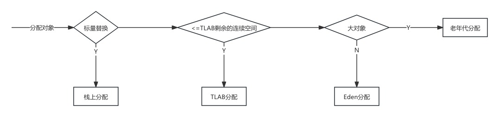
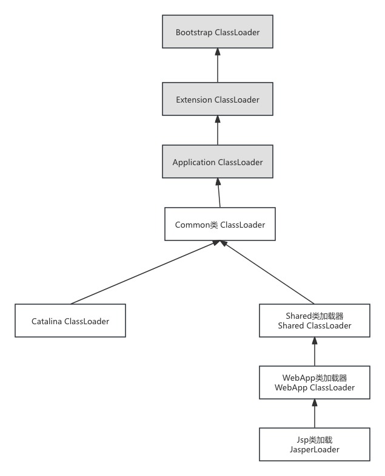

# JVM基础


# 一、java对象

## 1.1.对象的内存布局

对象在内存中主要分为三块数据: 对象头、实例数据、对齐数据.


### 对象头数据结构


### 对齐数据解析


### 数组和非数组对象


## 1.2.对象的内存分配策略




### 标量替换


### TLAB分配

#### TLAB介绍

> TLAB全称: Thread Local Allocation Buffer 线程本地分配缓冲区
>
> 程序启动时可以通过参数`-XX:UseTLAB`设置是否开启TLAB分配）
>
> TLAB并不是独立在堆空间之外的区域，而是JVM直接在`Eden`区为每条线程划分出来的。默认情况下，TLAB区域的大小只占整个`Eden`区的`1%`，不过也可以通过参数：`-XX:TLABWasteTargetPercent`设置TLAB区所占用`Eden`区的空间占比。
>
> 一般情况下，JVM会将TLAB作为内存分配的首选项（C2激进优化下的栈上分配除外），只有当TLAB区分配失败时才会开始尝试在堆上分配。


#### TLAB分配过程


### 老年代分配


> 初次分配时,大对象直接进入老年代. 
>
> 一般对象进入老年代的情况分为三种: 大对象初次分配、GC晋升长期存活对象、GC晋升动态年龄判断符合条件的对象
>
> 在JVM启动的时候你可以通过`-XX:PretenureSizeThreshold`参数指定大对象的阈值，如果对象在分配时超出这个大小，会直接进入年老代。


### Eden区分配

Eden区域分配时,会有两种分配方式:

- ①指针碰撞：指针碰撞是Java在为对象分配堆内存时的一种内存分配方式，一般适用于

  ```
  Serial、ParNew
  ```

  等不会产生内存碎片、堆内存完整的的垃圾收集器。

  - 分配过程：堆中已用分配内存和为分配的空闲内存分别会处于不同的一侧，通过一个指针指向分界点区分，当JVM要为一个新的对象分配内存时，只需把指针往空闲的一端移动与对象大小相等的距离即可。

- ②空闲列表：与指针碰撞一样，空闲列表同样是Java在为新对象分配堆内存时的一种内存分配方式，一般适用于CMS等一些会产生内存碎片、堆内存不完整的垃圾收集器。

  - 分配过程：堆中的已用内存和空闲内存相互交错，JVM通过维护一张内存列表记录可用的空闲内存块信息，当创建新对象需要分配内存时，从列表中找到一个足够大的内存块分配给对象实例，并同步更新列表上的记录，当GC收集器发生GC时，也会将已回收的内存更新到内存列表。


分配方式的选择,取决于GC垃圾回收器.

指针碰撞适合内存整齐的堆空间,空闲列表则更适合内存不完整的堆空间.

> 在Eden区分配内存时，因为是共享区域，必然会存在多条线程同时操作的可能，所以为了避免出现线程安全问题，在Eden区分配内存时需要进行同步处理，在HotSpot VM中采用的是线程CAS+失败换位重试的方式保证原子性。


## 1.3.初始化流程

对象初始化分为一下内容:

- 内存初始化
  - 各个数据类型对应的零
- 设置对象头
- 执行init函数
  -  先按顺序执行父类静态字段、静态代码块(哪个在前就先执行哪个)
  -  执行子类静态字段、静态代码块(哪个在前就先执行哪个)
  -  按顺序执行父类实例字段
  - 按顺序执行子类实例字段
  - 执行父类构造函数
  - 执行子类构造函数


## 1.4.对象的定位

对象的定位方式分为两种:句柄方式、直接指针

HotSpot使用直接指针方式进行对象访问


### 对象定位方式详解


### 对象引用

java对象引用分为四种:强引用、软引用、弱引用、虚引用

> 一下摘抄至深入理解java虚拟机 

#### 强引用


#### 软引用

内存不足时,会回收

#### 弱引用

> **弱引用与软引用最大的区别就是弱引用比软引用的生命周期更短暂。垃圾回收器在扫描它所管辖的内存区域的过程中，只要发现弱引用的对象，不管内存空间是否有空闲，都会立刻回收它**。

#### 虚引用

> 最弱的一种引用关系.一个对象是否有虚引用的存在,不会对其生存时间构成影响,也无法通过虚引用来获取对象.
>
> 为一个对象设置虚引用关联,就是在这个对象被垃圾回收器回收时收到一个通知.

```java
public static void main(String[] args) throws InterruptedException {
        ReferenceData obj = new ReferenceData();
        obj.setName("test");
        ReferenceQueue<ReferenceData> referenceQueue = new ReferenceQueue();
        PhantomReference<ReferenceData> phantomReference = new PhantomReference<>(obj,referenceQueue);
        Thread t = new Thread(()->{
             while(true){
                 Object ref = referenceQueue.poll();
                 if(ref!=null){
                     PhantomReference pRef = (PhantomReference) ref;
                     System.out.println(ref);
                     System.out.println(pRef.get());
                 }
             }
        });
        t.start();
        obj=null;
        System.gc();
        Thread.sleep(1000);
        System.gc();
        t.join();;
    }

console:
java.lang.ref.PhantomReference@36814be9
null
```

PhantomReference 可以监控对象的回收


### 虚引用和java自带的finalize功能区别

#### 虚引用

虚引用涉及的queue不会影响到GC的线程,只是起到通知作用,因为无法通过虚引用获取对象.

所以针对Phantom References 必须设置一个定时器不同的从queue队列中取出虚引用对象手动删除.

#### finalize功能

在可达性分析算法中,判断一个对象是否存活至少要经历两次标记过程.

- 直接从GC Roots出发,发现不可达
- 进行筛选,筛选条件是此对象是否有必要执行finalize()方法.
  - ·当对象没有重写finalize()方法或者该方法已经执行了一次,就会被标记成没必要执行
  - 如果重写了finalize()方法,并且没有被执行,就会执行一次finalize()方法

如果要执行该对象的finalize()方法,那么jvm会将该对象放置到F-Queue队列中.  并在稍后有一个虚拟机自动建立的、低优先级的Finalizer线程去执行它.


> 注意
>
> finalize()方法只能被执行一次.
>
> 不建议使用finalize方法来实现功能,如资源释放.可以有虚引用替换.


# 二、JVM内存区域

## 2.1.内存区域划分

jvm内存区域分为:程序计数器、虚拟机栈、本地方法栈、堆、方法区

### 常量池概念


# 三、JVM垃圾收集器和内存分配策略

## 3.1.常见垃圾回收算法


## 3.2.常见垃圾回收器


### CMS垃圾回收器

#### 概述:

CMS 是一种以 **低停顿时间** 为目标的垃圾回收器，主要用于老年代（Old Generation）的垃圾回收。它通过 **并发标记** 和 **并发清除** 的方式，尽量减少应用线程的停顿时间，适合对响应时间要求较高的应用（如 Web 服务器、实时系统）。

#### 回收流程

CMS主要流程如下:

1. 初始标记
   - 目标:标记从GC Roots直接可达的对象
   - 特点:需要STW,但是停顿时间很短
   - 触发条件: 老年代空间使用率达到一定阈值(默认92%)
2. 并发标记
   - 目标: 从初始标记对象出发,迭代标记所有对象
   - 特点: 与应用线程并发执行,不会导致应用停顿
   - 问题: 在标记过程,对象之间的引用可能发生变化
3. 重新标记
   - 目标:修正在并发标记过程中引用发生变化导致的标记错误
   - 特点: 需要STW,但是停顿时间比初始标记稍长
   - 优化: 通过卡表和写屏障减少需要重新标记的对象数量
4. 并发清除
   - 目标: 清除未被标记的对象,回收内存空间
   - 特点: 与应用线程并发执行,不会导致应用停顿
5. 并发重置
   - 目标: 重置CMS内部的数据结构,为下一次垃圾回收做准备
   - 特点: 与应用线程并发执行

####  CMS优点

CMS垃圾回收器具有以下优点:

- **低停顿时间**：通过并发标记和并发清除，减少了应用线程的停顿时间。
- **适合响应敏感型应用**：如 Web 服务器、实时系统等。
- **老年代回收效率高**：适用于老年代对象存活率较高的场景。


#### **CMS 的缺点**

1. **CPU 资源占用高**：并发标记和并发清除阶段会占用大量 CPU 资源，可能影响应用性能。
2. **内存碎片问题**：CMS 使用标记-清除算法，不会压缩内存，可能导致内存碎片，从而触发 Full GC。
3. **浮动垃圾（Floating Garbage）**：在并发清除阶段，应用线程可能产生新的垃圾对象，这些对象只能在下一次 GC 时回收。
4. **无法处理晋升失败**：如果老年代空间不足，可能导致晋升失败，触发 Full GC。

------

#### **CMS 的适用场景**

- **响应时间敏感型应用**：如 Web 服务器、实时系统。
- **老年代对象存活率较高的应用**：如缓存服务器、大数据处理系统。
- **内存充足且 CPU 资源较多的环境**：CMS 需要额外的 CPU 资源支持并发操作。


### G1垃圾回收器

#### 概述

G1（Garbage-First）是一种面向 **低停顿时间** 和 **高吞吐量** 的垃圾回收器，适用于大内存（几十 GB 到几百 GB）的应用。G1 的设计目标是替代 CMS（Concurrent Mark-Sweep）回收器，解决 CMS 的内存碎片和长时间停顿问题。使用标记整理算法.

G1 的核心思想是将堆内存划分为多个 **区域（Region）**，并根据垃圾回收的优先级（Garbage-First）动态选择区域进行回收。


#### 核心特点

1. **区域化内存管理**：
   - 堆内存被划分为多个大小相等的区域（Region），每个区域可以是 Eden、Survivor 或 Old 区域。
   - 区域的大小可以通过参数 `-XX:G1HeapRegionSize` 设置（默认根据堆大小自动计算）。
2. **分代收集**：
   - G1 仍然保留了分代的概念（新生代和老年代），但分代是逻辑上的，物理上由多个区域组成。
3. **并发与并行**：
   - G1 充分利用多核 CPU 的优势，在多个阶段使用并发和并行操作，减少停顿时间。
4. **可预测的停顿时间**：
   - 通过参数 `-XX:MaxGCPauseMillis` 设置目标停顿时间（默认 200ms），G1 会尽量满足这一目标。


#### 回收分类:

G1中提供了三种垃圾回收模式: YoungGC、Mixed GC和Full GC，在不同的条件下被触发。

- Young GC:回收 Eden 区和 Survivor 区的垃圾对象，需要短暂的 STW。
- Mixed GC:回收老年代中垃圾较多的区域，需要 STW，但停顿时间可控。
- Full GC : 当 G1 无法满足回收目标时，触发 Full GC，停顿时间较长。

#### 回收流程

G1工作流程分为以下几个阶段:

- 初始标记
- 并发标记
- 最终标记
  - 原始快照记录变更引用
- 筛选回收


#### 优点

G1垃圾回收器优点:

- 空间整合
  - CMS：“标记-清除”算法、内存碎片、若干次GC后进行一次碎片整理
  - G1将内存划分为一个个的region。内存的回收是以region作为基本单位的。Region之间是复制算法，但整体上实际可看作是标记-压缩算法，两种算法都可以避免内存碎片。这种特性有利于程序长时间运行，分配大对象时不会因为无法找到连续内存空间而提前触发下一次GC。尤其是当Java堆非常大的时候，G1的优势更加明显。
- 可预测的停顿时间模型（即:软实时soft real-time)
  - *这是G1 相对于CMS 的另一大优势，G1除了追求低停顿外，还能建立可预测的停顿时间模型，能让使用者明确指定在一个长度为 M 毫秒的时间片段内，消耗在垃圾收集上的时间不得超过N毫秒。*

由于分区的原因，G1可以只选取部分区域进行内存回收，这样缩小了回收的范围，因此对于全局停顿情况的发生也能得到较好的控制。G1 跟踪各个Region里面的垃圾堆积的价值大小（回收所获得的空间大小以及回收所需时间的经验值），在后台维护一个优先列表，每次根据允许的收集时间，优先回收价值最大的Region。保证了G1 收集器在有限的时间内可以获取尽可能高的收集效率。


## 3.3.内存分配策略


### 动态年龄判断

eden区对象进入老年代的年龄判断:

- 动态年龄判断:一般情况下,如果在S区相同年龄的所有对象大小总和大于S区空间的一半,那么S区所有大于等于该年龄的对象可以直接进入老年代.
- JVM参数设置年龄


### 空间分配担保

在发生MinorGC之前,虚拟机会检查老年代最大连续可用空间是否大于新生代所有对象总空间,如果这个条件成立,则MinorGC是安全的.

#### 如果老年代空间不够用

```
-XX：HandlePromotionFailure
```

如果小于老年代,则检查该参数是否为true,表示会继续检查历次晋升到老年代的对象的平均大小是否小于老年代的连续空间

- ​	小于,可以发生MinorGC,尽管有可能空间不够,最后导致发生FullGC
-    大于,发生FullGC

如果该参数设置为false,则直接进行FullGC


# 四、类加载机制

## 4.1.类加载过程

类加载机制过程分为以下几步

1. 加载类文件
2. 连接:验证、准备、解析
3. 初始化
4. 使用
5. 卸载


## 4.2.类加载器

### 类加载器种类

Java中的类加载器分为以下四类：

1. **Bootstrap ClassLoader（启动类加载器）**：
   - 负责加载JVM核心类库（如`java.lang.*`），通常位于`jre/lib`目录下。
   - 由C/C++实现，是JVM的一部分，不是Java类。
   - 是唯一没有父类加载器的加载器。
2. **Extension ClassLoader（扩展类加载器）**：
   - 负责加载`jre/lib/ext`目录下的扩展类库。
   - 是Java实现，父类加载器是`Bootstrap ClassLoader`。
3. **Application ClassLoader（应用程序类加载器）**：
   - 负责加载用户类路径（`classpath`）下的类。
   - 是Java实现，父类加载器是`Extension ClassLoader`。
   - 默认的类加载器。
4. **自定义类加载器**：
   - 用户可以继承`ClassLoader`类，实现自定义的类加载逻辑。
   - 常用于热部署、模块化加载等场景。

### 双亲委派模型

- **定义**：
  类加载器在加载类时，首先委托父类加载器尝试加载，只有当父类加载器无法加载时，才由自己加载。
- **优点**：
  - 避免类的重复加载。
  - 保证核心类库的安全性，防止用户自定义类替换核心类（如`java.lang.String`）。


### 打破双亲委派模型

#### 如何打破双亲委派模型


#### Tomcat 类加载机制

tomcat的类加载体系:





- commonLoader：Tomcat最基本的类加载器，加载路径中的class可以被Tomcat容器本身以及各个Webapp访问；
- catalinaLoader：Tomcat容器私有的类加载器，加载路径中的class对于Webapp不可见；
- sharedLoader：各个Webapp共享的类加载器，加载路径中的class对于所有Webapp可见，但是对于Tomcat容器不可见；
- WebappClassLoader：各个Webapp私有的类加载器，加载路径中的class只对当前Webapp可见；


##### 如果tomcat 的 Common ClassLoader 想加载 WebApp ClassLoader 中的类，该怎么办？

使用线程上下文类加载器实现，使用线程上下文加载器，可以让父类加载器请求子类加载器去完成类加载的动作


# 五、并发原理


# 六、线程安全和锁优化


# 七、JVM参数设置


## 垃圾回收器选择

jdk8默认垃圾回收器: Parallel Scavenge 和 Parallel Old

Parallel Scavenge追求高吞吐量，适合后台计算任务；而Parallel Old是其老年代版本，采用多线程的“标记-整理”算法。

开启CMS:-XX:+UseConcMarkSweepGC


## 堆设置

### 堆内存和机器内存比例

JVM 堆内存通常占用机器总内存的一部分，具体比例取决于应用的类型和机器的其他用途。以下是一个常见的分配建议：

| 机器总内存 | JVM 堆内存建议 | 备注                                                         |
| :--------- | :------------- | :----------------------------------------------------------- |
| 2GB        | 1GB            | 小内存机器，堆内存不宜过大，需为操作系统和其他进程预留空间。 |
| 4GB        | 2GB - 3GB      | 中等内存机器，堆内存可适当增加，但仍需预留足够空间。         |
| 8GB        | 4GB - 6GB      | 大内存机器，堆内存可分配较多，但仍需考虑其他进程和操作系统需求。 |
| 16GB       | 8GB - 12GB     | 高内存机器，适合内存密集型应用，堆内存可分配较大比例。       |
| 32GB+      | 16GB - 24GB    | 超大内存机器，堆内存可进一步增加，但需注意 GC 性能问题。     |

#### **考虑操作系统和其他进程**

- **操作系统**：需要为操作系统预留足够的内存（通常 1GB-2GB）。
- **其他进程**：如果机器上运行了其他进程（如数据库、缓存、监控工具等），需要为它们分配内存。
- **Native 内存**：JVM 除了堆内存外，还需要内存用于 Metaspace（类元数据）、线程栈、直接内存（Direct Buffer）等。

#### **根据应用类型调整**

- **内存密集型应用**（如大数据处理、缓存服务器）：
  - 堆内存可以分配较大比例（如机器总内存的 60%-70%）。
  - 需要监控 GC 性能，避免 Full GC 导致的停顿。
- **CPU 密集型应用**（如计算任务、实时处理）：
  - 堆内存可以分配较小比例（如机器总内存的 30%-50%）。
  - 需要确保 CPU 资源充足，避免 GC 占用过多 CPU 时间。

#### 最佳实践

- **避免过度分配**：堆内存过大可能导致 GC 停顿时间过长，影响应用性能。
- **预留足够空间**：确保为操作系统和其他进程预留足够的内存，避免系统因内存不足而崩溃。
- **动态调整**：根据应用的运行情况动态调整堆内存大小，找到最佳配置。一般先设置为一半,然后再动态调整.


### 堆内存设置参数

> - **-Xms**：初始堆大小（如 `-Xms2G` 表示初始堆大小为 2GB）。
> - **-Xmx**：最大堆大小（如 `-Xmx4G` 表示最大堆大小为 4GB）。
>
> 一般xms和xmx设置为相同数值
>
> 

#### 老年代、新生代设置

在 JVM 中，新生代和老年代的默认比例取决于使用的垃圾回收器。以下是一些常见的默认设置：

- **新生代与老年代比例**：默认是 `1:2`，即新生代占堆内存的 1/3，老年代占 2/3。
- **Eden 与 Survivor 比例**：默认是 `8:1:1`，即 Eden 区占新生代的 80%，Survivor 区（S1 和 S2）各占 10%。

设置参数,可以通过以下 JVM 参数调整堆内存中各区域的比例：

##### **新生代与老年代比例**

- **-XX:NewRatio**：设置新生代与老年代的比例。
  - 例如：`-XX:NewRatio=2` 表示新生代与老年代的比例为 1:2。
  - 默认值：2（即新生代占 1/3，老年代占 2/3）。

##### **Eden 与 Survivor 比例**

- **-XX:SurvivorRatio**：设置 Eden 区与 Survivor 区的比例。
  - 例如：`-XX:SurvivorRatio=8` 表示 Eden 区与每个 Survivor 区的比例为 8:1。
  - 默认值：8（即 Eden 区占 80%，每个 Survivor 区占 10%）。

#### **设置比例考虑事项**

##### **新生代与老年代比例**

- **内存密集型应用**：如果应用创建大量短期对象，可以增加新生代的比例（如 `-XX:NewRatio=1`，即新生代占 1/2，老年代占 1/2）。
- **长期存活对象较多的应用**：如果应用有大量长期存活的对象，可以增加老年代的比例（如 `-XX:NewRatio=3`，即新生代占 1/4，老年代占 3/4）。

##### **Eden 与 Survivor 比例**

- **短期对象较多的应用**：如果应用创建大量短期对象，可以增加 Eden 区的比例（如 `-XX:SurvivorRatio=10`，即 Eden 区占 90%，每个 Survivor 区占 5%）。
- **对象存活率较高的应用**：如果对象在 Survivor 区存活率较高，可以增加 Survivor 区的比例（如 `-XX:SurvivorRatio=6`，即 Eden 区占 75%，每个 Survivor 区占 12.5%）。