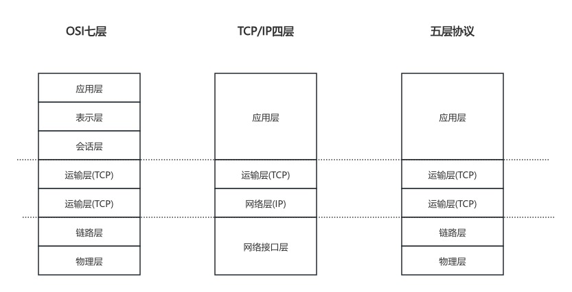
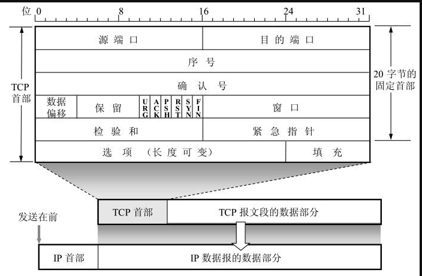
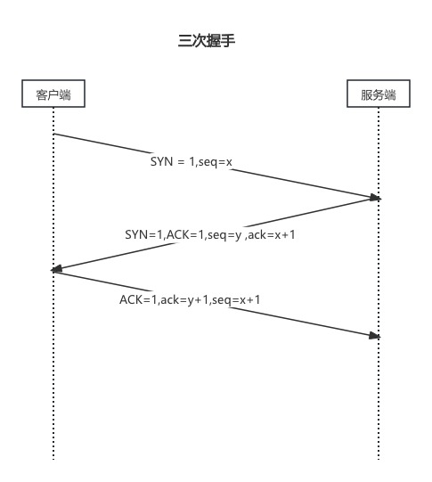
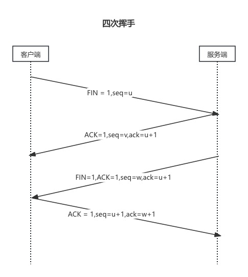

# 计算机网络基础

> 本文主要是学习了 计算机网络(谢希仁编著)这本书的读书笔记. 不做任何商业价值推广和收取相关费用.

# 概述

## 因特网

## 计算机网络

### 计算机网络的性能指标

度量计算机网络的性能一般从下面七个性能指标来看:速率、带宽、吞吐量、时延、时延带宽积、往返时间RTT、利用率

### 计算网络体系结构

计算机网络体系结构主要分为一下三种:五层协议的体系结构、OSI七层协议体系、TCP/IP协议

一般我们使用五层协议来学习.

#### 应用层

#### 运输层

> 运输层的任务就是负责向两个主机中进程之间的通信提供通用的数据传输服务.应用通过该通用传输服务传输应用间的报问(应用层协议数据).
>
> 所谓通用,是指并不正对某个特定网络应用,而是多种应用可以使用同一个运输层服务.由于一台主机可同时运行多个进程,因此运输层有复用和分用的功能.
>
> 复用就是多个应用层进程可同时使用下面的运输层服务,而分用是运输层把收到的信息分别交付上面应用层中的相应进程.

运输层主要是用一下两种协议:

- 传输控制协议TCP
- 用户数据报协议UDP

#### 链路层和物理层

# 主要层介绍

## 网络层

### ICMP

### 虚拟专用网VPN和网络地址转换NAT

## 传输层

### TCP

#### TCP报文头部

#### TCP可靠性传输的实现

#### TCP流量控制

#### TCP拥塞控制

#### TCP的运输连接管理

##### TCP建立流程

TCP建立连接过程:

- 客户端向服务端发出连接请求报文段
  - SYN标志设置为1,初始序号为seq = x, TCP规定,SYN报文段不能携带数据,但是消耗掉一个序号.
  - 客户端进程进入SYN-SENT(同步已发送)状态
- 服务端收到连接请求报文段后,如果同意建立连接,则向客户端发送确认
  - SYN标志设置为1,ACK标志设置为1
  - ack 确认号为x+1
  - 服务端自己选择一个初始序号seq=y
  - 这个报文段也不能携带数据,但同样要消耗一个序号,这时服务端进程进入SYN-REVD(同步收到)状态
- 客户端收到确认报文后,还需要向服务端进行确认
  - ACK标志设置为1
  - ack确认号为y+1
  - seq序号为x+1
  - TCP标准规定,ACK报文段可以携带数据,但如果不携带数据,则不消耗序号.
  - 这时客户端进程进入ESTABLISHED(已建立连接)状态
- 服务端收到确认报文后
  - 也进入ESTABLISHED状态

##### TCP断开流程

四次挥手过程

- 客户端发起断开连接请求(也有可能是服务端)
  - FIN标志设置为1
  - 序号为seq = u,最后数据序列号+1
  - 客户端进程进入FIN-WAIT-1(终止等待1)状态
- 服务端收到客户端发来的断开连接请求,发出确认报文
  - ACK 标志设置为1
  - ack确认号: ack = u+1
  - 自身序号为: seq = v
  - 客户端进入CLOSE-WAIT(关闭等待)状态
- 客户端收到确认报文后进入到FIN-WAIT-2状态
- 服务端向客户端发送FIN报文
  - FIN标志设置为1,ACK标志设置为1
  - 自身序号 : seq = w
  - ack确认号: ack = u+1
- 客户端收到服务端的FIN报文
  - 进入到TIME_WAIT状态
  - 发送确认
    - ACK标志为1
    - ack确认号为: ack = w+1
    - 自身序号: seq = u+1
- 服务端收到确认报文,进入CLOSE状态
- 客户端等待TIME_WAIT时间后,进入COLSE状态,TIME_WAIT = 2MSL(最长报文段寿命)

## 应用层

### DNS

### FTP

### TELNET

### HTTP协议

浏览器输入网址,点击回车后发生的事情:

1. 浏览器分析链接指向页面URL
2. 浏览器向DNS请求解析url中域名的ip地址
3. 域名系统解析出ip地址
4. 浏览器与服务器建立TCP连接
5. 浏览器发出 请求 get/post等
6. 服务器根据 请求路径,将处理结果返回浏览器
7. 释放TCP连接
8. 浏览器展示结果

### HTTPS

### 电子邮件

### DHCP

### SNMP

## 总结

### HTTP/HTTPS/TCP对比

|      | HTTP                                                       | HTTPS  | TCP    |
| ---- | ---------------------------------------------------------- | ------ | ------ |
| 层次 | 应用层                                                     | 应用层 | 传输层 |
|      | 无状态协议                                                 |        | 有状态 |
|      | 无连接(短链接:每次请求结束,tcp断开,长连接:TCP不会主动断开) |        | 有连接 |

# 网络安全

## 加密

## 数字签名

