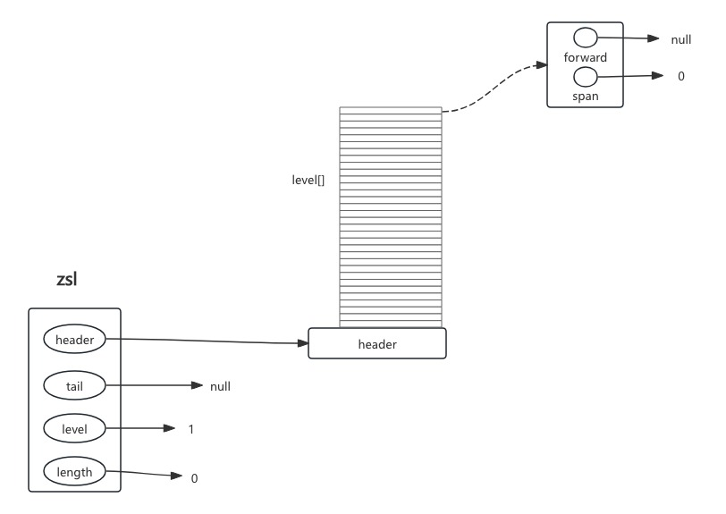
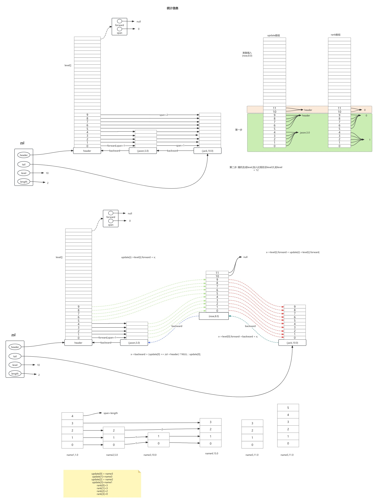

# zset源码学习

> 说明:
>
> 本文章的redis源码是基于redis7.4版本,主要总结的是skiplist编码格式的zset.
>
> 如有理解错误,请指出.本人学习redis时间较短,可能有些理解不太充分.


# Redis zset对象的创建

## redis zset对象涉及的对象结构

只关注编码方式为:skipList的zset

```c++
//跳表的链表节点
typedef struct zskiplistNode {
    sds ele;
    double score;
    struct zskiplistNode *backward; //后退指针
    struct zskiplistLevel { //层级节点
        struct zskiplistNode *forward; //前进指针
        unsigned long span; //跨度
    } level[]; //每个节点上的层级数组
} zskiplistNode;

//跳表结构
typedef struct zskiplist {
    struct zskiplistNode *header, *tail; //头、尾指针
    unsigned long length; //链表长度
    int level; //目前层级最大值
} zskiplist;

//zset结构
typedef struct zset {
    dict *dict; //字典
    zskiplist *zsl; //跳表
} zset;

//redis对象结构
struct redisObject {
    unsigned type:4;
    unsigned encoding:4;
    unsigned lru:LRU_BITS; /* LRU time (relative to global lru_clock) or
                            * LFU data (least significant 8 bits frequency
                            * and most significant 16 bits access time). */
    int refcount;
    void *ptr;
};

```


## 创建一个Redis zset对象

### 触发条件

当我们使用一些zset相关的命令,如`ZADD`、`ZINCRBY` 以及带有 `STORE` 选项的 `ZDIFF`、`ZINTER` 和 `ZUNION` 命令都能触发创建 ZSET 对象。

以zset的zadd命令为例:

```c++
void zaddGenericCommand(client *c, int flags) {
robj *zobj;
  ....
    zobj = lookupKeyWrite(c->db,key); //查找zset
    if (checkType(c,zobj,OBJ_ZSET)) goto cleanup;
    if (zobj == NULL) {
        if (xx) goto reply_to_client; /* No key + XX option: nothing to do. */
        zobj = zsetTypeCreate(elements, sdslen(c->argv[scoreidx+1]->ptr));
        dbAdd(c->db,key,zobj);
    } else {
        zsetTypeMaybeConvert(zobj, elements);
    }
  ....
}
```

1. 第一步:从client对象中解析出参数,如zset 的key
2. 从当前db中查找,是否存在该key,如果存在直接返回该key对应的对象
3. 如果为null,需要创建一个zset对象,zsetTypeCreate
4. 如果不为null,判断是否需要进行对象编码格式转化,  压缩列表->跳表,有zsetTypeMaybeConvert函数实现


### zsetTypeCreate函数

```c++
robj *zsetTypeCreate(size_t size_hint, size_t val_len_hint) {
    if (size_hint <= server.zset_max_listpack_entries &&
        val_len_hint <= server.zset_max_listpack_value) 
    {
        return createZsetListpackObject();
    }

    robj *zobj = createZsetObject();
    zset *zs = zobj->ptr;
    dictExpand(zs->dict, size_hint);
    return zobj;
}

//zset对象创建
robj *createZsetObject(void) {
    zset *zs = zmalloc(sizeof(*zs));
    robj *o;

    zs->dict = dictCreate(&zsetDictType); //创建一个字典
    zs->zsl = zslCreate(); //创建一个跳表
    o = createObject(OBJ_ZSET,zs); //创建一个对象,将zset指针传进去
    o->encoding = OBJ_ENCODING_SKIPLIST;
    return o;
}

```


> 判断zset编码转化临界条件 在redis.conf中有配置:zset-max-listpack-entries 128 zset-max-listpack-value 64

创建zset流程如下:

- 判断添加元素个数,根据不同的个数选择创建不同类型的zset
  - 如果不满足size_hint <= server.zset_max_listpack_entries && val_len_hint <= server.zset_max_listpack_value,就创建跳表类型的zset
  - 如果满足,就创建压缩列表类型的zset
- createZsetObject skiplist编码的zset
  - 动态分配一块内存，这块内存的大小恰好能容纳一个 `zset` 类型的对象，并且把这块内存的起始地址赋值给指针 `zs`。
  - 创建字典和skiplist分对象指针赋值给zset的dict和zsl
  - 设置zset对象的编码为OBJ_ENCODING_SKIPLIST

### skiplist初始化zslCreate

```c++
/* Create a new skiplist. */
zskiplist *zslCreate(void) {
    int j;
    zskiplist *zsl;

    zsl = zmalloc(sizeof(*zsl));
    zsl->level = 1;
    zsl->length = 0;
    zsl->header = zslCreateNode(ZSKIPLIST_MAXLEVEL,0,NULL);
    for (j = 0; j < ZSKIPLIST_MAXLEVEL; j++) {
        zsl->header->level[j].forward = NULL;
        zsl->header->level[j].span = 0;
    }
    zsl->header->backward = NULL;
    zsl->tail = NULL;
    return zsl;
}
```

初始化示意图:




# Redis zset对象的插入操作

以zadd操作为例

```c++
int zsetAdd(robj *zobj, double score, sds ele, int in_flags, int *out_flags, double *newscore) {

  ....
   //skiplist
   if (zobj->encoding == OBJ_ENCODING_SKIPLIST) {
      
          zset *zs = zobj->ptr;
          zskiplistNode *znode;
          dictEntry *de;

          de = dictFind(zs->dict,ele);
          if (de != NULL) {
             //存在当前数据,更新score
          }else if (!xx) {
            //新增元素
            ele = sdsdup(ele); //复制元素key 
            znode = zslInsert(zs->zsl,score,ele); //插入key和score
            serverAssert(dictAdd(zs->dict,ele,&znode->score) == DICT_OK);
            *out_flags |= ZADD_OUT_ADDED;
            if (newscore) *newscore = score;
            return 1;
        } else {
            *out_flags |= ZADD_OUT_NOP;
            return 1;
        }
   }
  ....
}


//skipList 插入流程
zskiplistNode *zslInsert(zskiplist *zsl, double score, sds ele) {
    zskiplistNode *update[ZSKIPLIST_MAXLEVEL], *x;
    unsigned long rank[ZSKIPLIST_MAXLEVEL];
    int i, level;

    serverAssert(!isnan(score));
    x = zsl->header;
    for (i = zsl->level-1; i >= 0; i--) {
        /* store rank that is crossed to reach the insert position */
        rank[i] = i == (zsl->level-1) ? 0 : rank[i+1];
        while (x->level[i].forward &&
                (x->level[i].forward->score < score ||
                    (x->level[i].forward->score == score &&
                    sdscmp(x->level[i].forward->ele,ele) < 0)))
        {
            rank[i] += x->level[i].span;
            x = x->level[i].forward;
        }
        update[i] = x;
    }
    /* we assume the element is not already inside, since we allow duplicated
     * scores, reinserting the same element should never happen since the
     * caller of zslInsert() should test in the hash table if the element is
     * already inside or not. */
    level = zslRandomLevel();
    if (level > zsl->level) {
        for (i = zsl->level; i < level; i++) {
            rank[i] = 0;
            update[i] = zsl->header;
            update[i]->level[i].span = zsl->length;
        }
        zsl->level = level;
    }
    x = zslCreateNode(level,score,ele);
    for (i = 0; i < level; i++) {
        x->level[i].forward = update[i]->level[i].forward;
        update[i]->level[i].forward = x;

        /* update span covered by update[i] as x is inserted here */
        x->level[i].span = update[i]->level[i].span - (rank[0] - rank[i]);
        update[i]->level[i].span = (rank[0] - rank[i]) + 1;
    }

    /* increment span for untouched levels */
    for (i = level; i < zsl->level; i++) {
        update[i]->level[i].span++;
    }

    x->backward = (update[0] == zsl->header) ? NULL : update[0];
    if (x->level[0].forward)
        x->level[0].forward->backward = x;
    else
        zsl->tail = x;
    zsl->length++;
    return x;
}
```


根据上面的代码画一个示意图,方便理解:




我把插入主要分为两部分,第一部分是插入前的数据收集,第二部分是更新节点.

### 数据收集

```c++
    
    x = zsl->header;
    for (i = zsl->level-1; i >= 0; i--) {
        /* store rank that is crossed to reach the insert position */
        rank[i] = i == (zsl->level-1) ? 0 : rank[i+1];
        while (x->level[i].forward &&
                (x->level[i].forward->score < score ||
                    (x->level[i].forward->score == score &&
                    sdscmp(x->level[i].forward->ele,ele) < 0)))
        {
            rank[i] += x->level[i].span;
            x = x->level[i].forward;
        }
        update[i] = x;
    }


    level = zslRandomLevel();
    if (level > zsl->level) {
        for (i = zsl->level; i < level; i++) {
            rank[i] = 0;
            update[i] = zsl->header;
            update[i]->level[i].span = zsl->length;
        }
        zsl->level = level;
    }
```

update数组主要用于收集每一个level该要插入的节点对应的前一个节点.

rank数组用于收集当前level的节点相对于header的span,即跨度值.如rank[level-1] = 0 ,rank[0]是最大的,即该插入节点的前一个节点相对于header的跨度

数据收集分为两部分:

- 第一部分为当前已有level的收集
- 第二部分,生成当前节点的level,该level有可能比现有的level大,所以要对update和rank数组中的新的level进行数据更新.


### 指针变更

```c++
    x = zslCreateNode(level,score,ele);
    for (i = 0; i < level; i++) {
        x->level[i].forward = update[i]->level[i].forward;
        update[i]->level[i].forward = x;

        /* update span covered by update[i] as x is inserted here */
        x->level[i].span = update[i]->level[i].span - (rank[0] - rank[i]);
        update[i]->level[i].span = (rank[0] - rank[i]) + 1;
    }

    /* increment span for untouched levels */
    for (i = level; i < zsl->level; i++) {
        update[i]->level[i].span++;
    }

    x->backward = (update[0] == zsl->header) ? NULL : update[0];
    if (x->level[0].forward)
        x->level[0].forward->backward = x;
    else
        zsl->tail = x;
    zsl->length++;
    return x;
```


1. 创建当前要插入的节点
2. 从底层遍历,设置当前节点每一个level的forward值
   1. 当前节点每个level的forward就是update数组对应的level的forward
3. 设置该节点每个level前面的节点的forward
   1. update数组存储的就是该节点每个level的前驱节点,直接把update[i]->level[i].forward = x;
4. 更新当前节点每个level的跨度值
   1. 下面详细说明
5. 设置当前节点的backward和下一个节点的backward
6. 更新tail和链表length


### span的更新

#### 当前节点生成的level大于当前skiplist的level

```
    for (i = 0; i < level; i++) {
        x->level[i].forward = update[i]->level[i].forward;
        update[i]->level[i].forward = x;

        /* update span covered by update[i] as x is inserted here */
        x->level[i].span = update[i]->level[i].span - (rank[0] - rank[i]);
        update[i]->level[i].span = (rank[0] - rank[i]) + 1;
    }
```

按图中示例:

要插入节点(name5,11.0),level = 6;

则按照代码逻辑:

```
x.level[0]=update[0].level[0].span 即: 1              update[0]->level[0].span = (rank[0] - rank[0]) + 1; = 1
x.level[1]=update[1].level[1].span-0 即: 1            update[1]->level[1].span = (rank[0] - rank[1]) + 1; = 1
x.level[2]=update[2].level[2].span-(3-2) 即: 2-1=1    update[2]->level[2].span = (rank[0] - rank[2]) + 1; 即(3-2)+1 = 2

x.level[3]=update[3].level[3].span - (3-1) 即: 3-2=1  update[3]->level[3].span = (rank[0] - rank[3]) + 1; 即(3-1)+1 = 3

update[4].level[4]=3
update[5].level[5].span =zsl.length = 4;
x.level[4]=update[4].level[4].span - (3-1) 即: 3-(3-1)=1  update[4]->level[4].span = (rank[0] - rank[4]) + 1; 即(3-1)+1 = 3
x.level[5]=update[5].level[5].span - (3-1) 即: 4-(3-0)=1  update[4]->level[5].span = (rank[0] - rank[5]) + 1; 即(3-0)+1 = 4
```

在数据收集阶段,有这么一块逻辑

```c++
 if (level > zsl->level) {
        for (i = zsl->level; i < level; i++) {
            rank[i] = 0;
            update[i] = zsl->header;
            update[i]->level[i].span = zsl->length;
        }
        zsl->level = level;
    }
//当生成的level大于现有的level时候,则从(zsl.level,level-1),所有的update[i].level[i].span = 链表长度,rank[i]=0;
```


#### 当前节点生成的level小于等于当前skiplist的level

如果当前的节点生成的level小于已有的level,则当前节点的level数据更新和上面相同

```
  for (i = level; i < zsl->level; i++) {
        update[i]->level[i].span++;
   }

```

但是在当前节点level和zsl.level之间的数据也需要更新,应为底层level新增了一个节点,所以这块代码逻辑,就是对当前节点的前驱节点的(level,zsl.level)之间的span进行+1操作


# Redis zset如何查找一个对象

zset内部维护的一个dict字典,当判断元素是否存在或者对元素进行操作时,直接通过元素的key进行O(1)的查找,进行操作.


