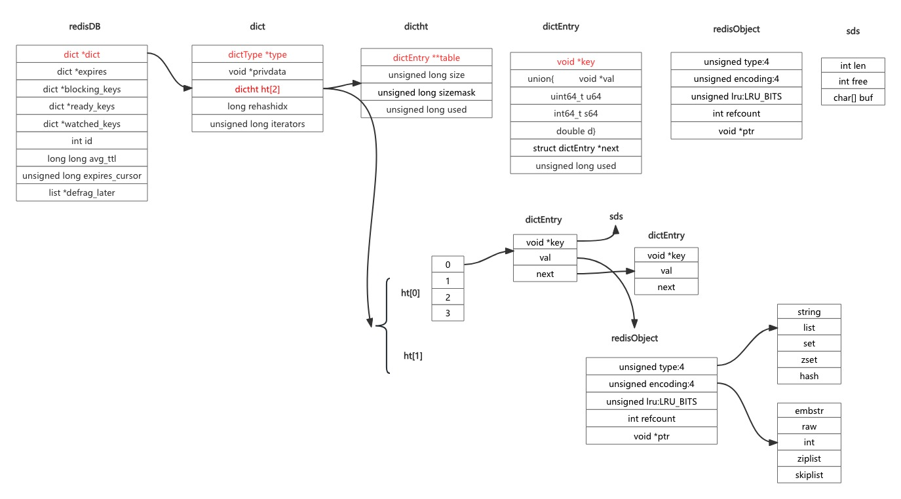
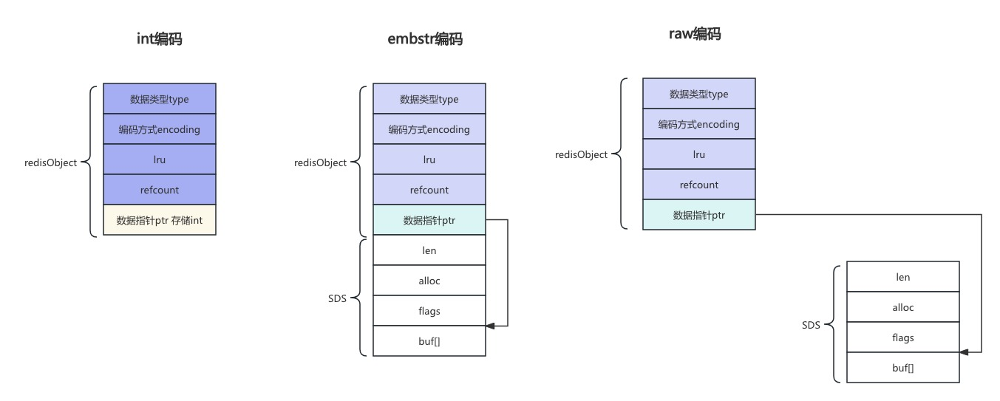
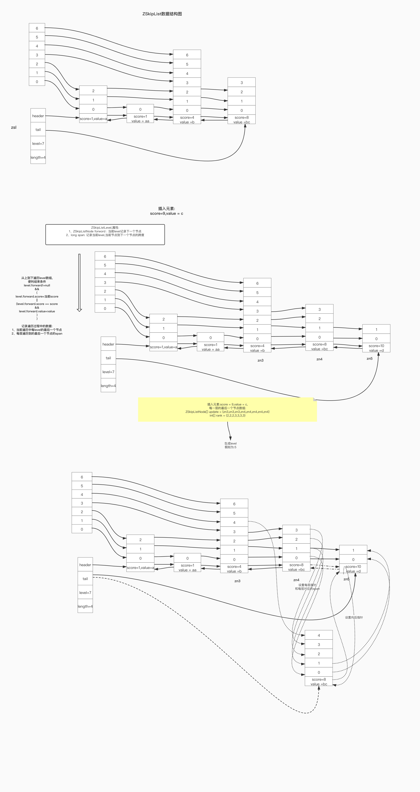

# Redis数据结构与对象


> 在redis数据库中每个键值对key-value都是有对象组成的,其中key都是字符串对象,value对象类型有五种:
>
> 字符串对象、列表对象、哈希对象、集合对象、有序集合对象.
>
> 这五种数据对象是提供给用户直接使用的,其底层实现主要依赖以下8种数据结构:
>
> 简单动态字符串、字典表、双向链表、跳表、整数集合、压缩列表、快速列表

# Redis对象系统




# Redis数据类型

## 字符串

### 基础使用

#### 介绍

> redis字符串是二进制安全的
>
> redis字符串可以存储字节序列,包括文本、序列化对象、二进制数组
>
> redis字符串特殊功能: 计数器、bitmap(位图)

#### 限制

##### 大小

> 默认情况下,redis字符串最大大小为512MB,
>
>  所以redis的key最大为512MB


##### 扩容/缩容

空间预分配:

> 如果大小小于1MB,每次扩容增加一倍,缩容减少1倍
>
> 有一个注意点:如果字符串类型不同,需要重新分配内容,并将旧数据copy到新空间
>
> sds类型分为:SDS_TYPE_5、SDS_TYPE_8、SDS_TYPE_16、SDS_TYPE_32、SDS_TYPE_64
>
> SDS_TYPE_5：这个比较特殊，注释上说未被使用，但是也不完全准确，无论如何这个类型都不是我们讨论的重点。
> SDS_TYPE_8: 当len 小于 1 << 8，也就是小于256时，变量len和alloc用uint8类型。
> SDS_TYPE_16: 当len 小于 1 << 16，也就是小于65536时，变量len和alloc用uint16类型。
> SDS_TYPE_32: 当len 小于 1 << 32，也就是小于4294967296时，变量len和alloc用uint32类型。
> SDS_TYPE_64: 当len 大于等于 1 << 32，也就是大于等于4294967296时，变量len和alloc用uint64类型。


**惰性空间释放：**

惰性空间释放用于优化SDS的字符串缩短操作，当SDS需要缩短保存的字符串时，程序并不立即使用内存分配来回收缩短后多出来的字节，而是使用free属性将这些字节数量记录起来，并等待将来使用。


### 特殊使用

#### 计数器

```
incr key    对key的数值增加1
incrby key step 对key的数值增加step
decr key  对key的数值减少1
decrby key step 对key的数值减少step
```

#### 位图

**介绍**

> Bitmaps are not an actual data type, but a set of bit-oriented operations defined on the String type which is treated like a bit vector. Since strings are binary safe blobs and their maximum length is 512 MB, they are suitable to set up to 2^32 different bits.
> 位图不是一种实际的数据类型，而是在 String 类型上定义的一组面向位的作，该类型被视为位向量。由于字符串是二进制安全 blob，其最大长度为 512 MB，因此它们适用于设置多达 2^32 个不同的位。
>
> redis官方说明

**常用命令**

命令主要分为两种:

1. 单个操作:获取指定bit的值,或者设置指定位置的bit
2. 组操作: 如给定区间内设置bit的数量等

```
getbit  获取指定位置的bit值
setbit  设置指定位置 bit值
bitcount count指定区间的1总数
bitops 查找第一个0或者1的位置
```

### 原理

#### SDS

**redis6版本**

```
redis6

/* Note: sdshdr5 is never used, we just access the flags byte directly.
 * However is here to document the layout of type 5 SDS strings. */
struct __attribute__ ((__packed__)) sdshdr5 {
    unsigned char flags; /* 3 lsb of type, and 5 msb of string length */
    char buf[];
};
struct __attribute__ ((__packed__)) sdshdr8 {
    uint8_t len; /* used */
    uint8_t alloc; /* excluding the header and null terminator */
    unsigned char flags; /* 3 lsb of type, 5 unused bits */
    char buf[];
};
struct __attribute__ ((__packed__)) sdshdr16 {
    uint16_t len; /* used */
    uint16_t alloc; /* excluding the header and null terminator */
    unsigned char flags; /* 3 lsb of type, 5 unused bits */
    char buf[];
};
struct __attribute__ ((__packed__)) sdshdr32 {
    uint32_t len; /* used */
    uint32_t alloc; /* excluding the header and null terminator */
    unsigned char flags; /* 3 lsb of type, 5 unused bits */
    char buf[];
};
struct __attribute__ ((__packed__)) sdshdr64 {
    uint64_t len; /* used */
    uint64_t alloc; /* excluding the header and null terminator */
    unsigned char flags; /* 3 lsb of type, 5 unused bits */
    char buf[];
};
```

结构:

> len:已使用长度
>
> alloc总长度,不包括header和null终止符
>
> flags:高三位为类型,低5位为未使用
>
> buf[]. : 字符数组

在redis6里面没有了free字段,因为可以通过alloc-len得到.

*redisObject ptr指针指向buf的起始地址,通过减去一个char固定长度,得到类型和未使用长度.*


#### 编码

字符串对象编码有三种:

- int编码: 如果一个字符串对象保存的是整数值，并且这个整数值可以用long类型来表示，那么字符串对象会将整数值保存在字符串对象结构的ptr属性里面（将void* 转换成long），并将字符串对象的编码设置为int。
- raw编码: 如果字符串对象保存的是一个字符串值，并且这个字符串值的长度大于32字节，那么字符串对象将使用一个简单动态字符串（SDS）来保存这个字符串值，并将对象的编码设置为raw。
- embstr编码: 如果字符串对象保存的是一个字符串值，并且这个字符串值的长度小于等于32字节，那么字符串对象将使用embstr编码的方式来保存这个字符串值。

> `embstr`编码是专门用于保存短字符串的一种优化编码方式，通过调用一次内存分配函数来分配一块连续的空间，空间中依次包含redisObject和sdshdr两个结构，而`raw`编码会调用两次内存分配函数来分别创建。释放`embstr`编码字符串也只需要一次调用。





### 应用

> 位图类应用:
>
> - 用户签到,如 sign_user:用户id。 签到成功设置对应的pos为1, 可以设置相对某一个时间的偏移量.
> - 系统用户在线状态, 每个用户对应一个bit位
> - 布隆过滤器
> - 统计活跃用户: 每日一个bitmap, 如果要统计一段时间内的活跃用户,直接对多个bitmap进行or位运算
> - ip黑白名单
> - 统计uv

注意事项:避免出现大key问题,对单个key进行拆分,先根据一定规则定位到key,然后再进行操作


## List列表

### 基础使用

常规列表操作

```
LPUSH: 将元素添加到列表头部, RPUSH:将元素添加到列表尾部
LPOP :将列表头部元素弹出,RPOP:将列表尾部元素弹出
LLEN: 返回列表长度
LMOVE: LMOVE mylist myotherlist RIGHT LEFT 将mylist的最后一个元素,移动到myotherlist的头部,LMOVE mylist myotherlist  LEFT RIGHT :将mylist的第一个元素,移动到myotherlist的尾部
LRANGE: lrange key start end 返回列表指定区间的元素
LTRIM: LTRIM KEY_NAME START STOP 保留指定区间的元素,其他元素删除
```

列表阻塞操作:

```
BLPOP:从列表的头部删除并返回一个元素。如果列表为空，则命令将阻止，直到元素可用或达到指定的超时
BLMOVE:以原子方式将元素从源列表移动到目标列表。如果源列表为空，则命令将阻塞，直到有新元素可用
```

### 限制和性能

> Redis 列表的最大长度为 2^32 - 1 （4,294,967,295） 个元素。

### 原理

Redis的list支持两种编码方式: ZipList 和 LinkedList

适用条件:

- zipList
  - 所有键值对的长度都小于64个字节
  - 键值对个数小于512个
- linkedList
  - 不符合zipList的情况

### 应用

> 最近功能: 如最近浏览记录、最近访问记录、最近发布记录等
>
> 阻塞队列

注意事项:

*List在头尾操作比较快,涉及中部操作,如Lindex,Linsert,Lset等,在List比较大时,耗时比较严重.*


## 字典

### 基础使用

```
hget key field     获取field
hset key field value 设置field
hincrby key field step  对field增加step
```

### 原理

#### 字典编码实现

字典的编码方式有两种:ZipList和HashTable

适用条件:

- ZipList:同时满足以下条件
  - 所有键值对的长度都小于64个字节
  - 键值对个数小于512个
- HashTable
  - 不符合zipList的情况


#### 字典数据结构

```
typedef struct dict{
  //类型特定函数
  dictType *type;
  //私有数据
  void *privdata;
  //哈希表
  dictht ht[2];
  //rehash索引, 当rehash不再进行时,值为1
  int rehashidx;
}
```

#### 字典rehash过程

rehash流程:

- 为字典ht[1]分配空间
  - 扩容: ht[1] 的空间为大于等于ht[0].used*2 的第一个2^n 
  - 缩容: ht[2]的空间为大于等于ht[0].used 的第一个2^n
- 将字典ht[0]里面的数据rehash到ht[1]上面
- 当所有ht[0]里面的数据都rehash到ht[1]上面后,将ht[1]赋值给ht[0],然后将ht[1]设置为null


rehash过程不是一次性的,而是渐进的,分多次进行.

- 为ht[1]分配空间
- 将rehashidx设置为0,表示rehash开始
- 在rehash期间,每次对字典执行查询、更新、添加、删除时,除了完成对应操作,还会将ht[0]在rehashidx位置的数据全部rehash到ht[1]上,完成rehash后,将rehashidx值加1
- 当最后一个rehashidx位置的数据rehash完成后,将rehashidx设置为-1,表示rehash完成


> 在rehash过程,查找、更新、删除都会在两个哈希表上进行,新增只会在ht[1]上进行


## 集合

### 基础使用

> A Redis set is an unordered collection of unique strings (members). You can use Redis sets to efficiently:
>
> Redis set 是一个无序集合,存储字符串,每个字符串都是唯一的.支持如下高效操作:
>
> - Track unique items (e.g., track all unique IP addresses accessing a given blog post).
>   跟踪唯一项目（例如，跟踪访问给定博客文章的所有唯一 IP 地址）。
> - Represent relations (e.g., the set of all users with a given role).
>   表示关系（例如，具有给定角色的所有用户的集合）。
> - Perform common set operations such as intersection, unions, and differences.
>   执行常见的集作，例如交集、并集和差集。
>
> 来自Redis官方


```shell
sadd key member ... 新增元素
srem key member    删除元素
SISMEMBER key member 判断是否存在,存在返回1,否则0
sinter key1 key2 ... 返回集合交集,也是一个集合
scard key 返回集合大小
```


### 限制和性能

> Redis 集的最大大小为 2^32 - 1 （4,294,967,295） 个成员。


### 原理

#### 集合编码实现

集合支持两种编码:intset 和hashtable

适用条件:

- Intset:
  - 所有元素都是整数值
  - 元素个数小于512
- hashtable
  - 不符合intset条件


## 有序集合


### 原理

#### 有序集合编码实现

有序集合编码实现主要有两种:

- ziplist
- skiplist

适用条件

- ziplist
  - 所有元素的长度小于64字节
  - 元素个数小于128个
- skiplist
  - 不符合zipList情况

#### skiplist原理

##### 理想跳跃表

在理想情况下:

- 最底层元素是一个单链表
- 从最底层往上,每一层的元素个数是之前一层的1/2

##### 跳跃表数据结构

```


#跳表节点
typedef struct zskiplistNode {
    sds ele;
    double score;
    struct zskiplistNode *backward;
    #跳表表示level的数据
    struct zskiplistLevel {
        struct zskiplistNode *forward;
        unsigned long span;
    } level[];
} zskiplistNode;

#跳表 list结构
typedef struct zskiplist {
    struct zskiplistNode *header, *tail;
    unsigned long length;
    int level;
} zskiplist;

#zset 结构
typedef struct zset {
    dict *dict;
    zskiplist *zsl;
} zset;
```





跳跃表的最大层数:32层

https://mp.weixin.qq.com/s?__biz=MzU0OTE4MzYzMw==&mid=2247512204&idx=4&sn=8a2a24e139f1c5fdfcc0f017b280bd0e&chksm=fbb13972ccc6b0647387c63c87acb6f638ce8c99dca30d958a4e91ed766224f50a32ec7281ad&scene=27


