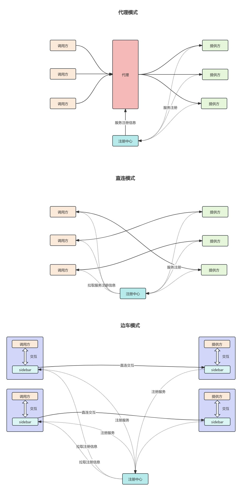
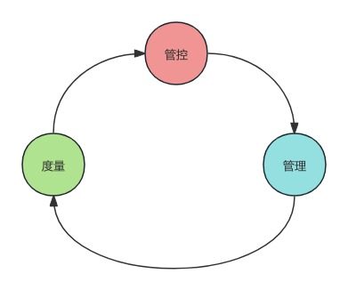
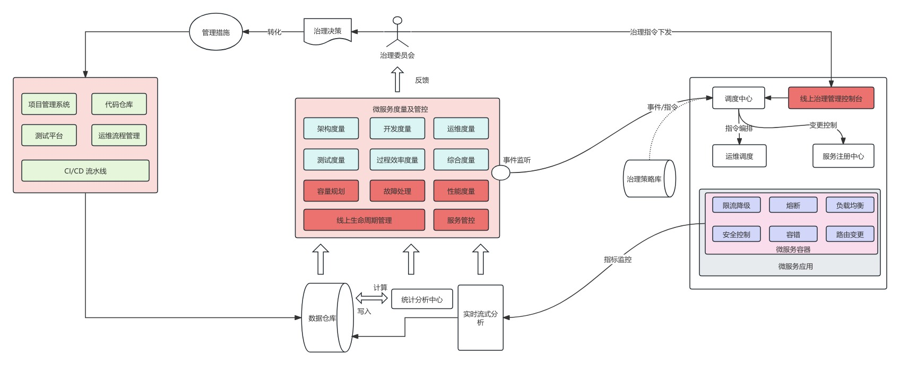

# 服务治理

# 为什么要进行服务治理

## 微服务架构

### **一、代理架构（Proxy Architecture）**

#### **核心设计**

通过一个集中式代理（如网关、API 网关）处理所有服务间的通信，客户端不直接调用目标服务，而是统一通过代理转发请求。

#### **典型实现**

- **网关层代理**：Nginx、APISIX、Kong
- **服务网格控制平面代理**：Istio 的 Pilot（间接通过数据平面 Sidecar 实现）

#### **优点**

1. **统一管控能力强**
   - 流量控制、认证授权、限流熔断等逻辑集中在代理层，便于全局配置（如所有服务统一启用 TLS 认证）。
   - 案例：电商平台通过网关统一实现 IP 黑白名单，防止恶意请求。
2. **客户端无侵入**
   - 服务调用方无需集成任何 SDK 或框架，仅需向代理发送请求，适合多语言混合架构（如 Java 服务与 Python 服务通过网关通信）。
3. **简化服务拓扑**
   - 服务间调用链路从网状变为 “客户端 - 代理 - 服务” 的星形结构，降低依赖复杂度。

#### **缺点**

1. **单点故障风险**
   - 代理层成为整个系统的瓶颈，若网关崩溃，所有服务通信中断（需通过集群部署 + 熔断机制缓解）。
2. **性能损耗明显**
   - 请求需经过代理转发，增加至少一次网络往返（如客户端→网关→服务），延迟升高约 50-100ms。
3. **功能扩展受限**
   - 代理层逻辑过重时（如同时处理路由、认证、日志），升级维护困难，且难以支持细粒度的服务治理（如按服务版本分流）。

#### **适用场景**

- **多语言微服务初期**：快速搭建通信架构，避免各语言重复开发服务治理能力。
- **面向外部的 API 接口**：如开放平台对外提供 API 时，通过网关统一做权限控制与流量监控。

### **二、直连架构（Direct Connection Architecture）**

#### **核心设计**

服务间直接通过网络协议（如 HTTP、gRPC）调用，无需中间代理，客户端需知道目标服务的地址与端口。

#### **典型实现**

- **客户端负载均衡**：Spring Cloud Ribbon、ServiceComb LoadBalancer
- **服务注册与发现**：Eureka、Nacos、Consul

#### **优点**

1. **高性能通信**
   - 无代理转发，请求延迟最低（如同一机房内服务调用延迟可控制在 10ms 以内），适合对实时性要求高的场景（如金融交易、实时聊天）。
2. **灵活性高**
   - 服务可根据需求选择不同通信协议（如 HTTP/2、TCP 长连接），自定义负载均衡策略（如按请求权重、响应时间动态调整）。
3. **去中心化设计**
   - 无单点瓶颈，服务实例可独立扩缩容，系统可用性更高（如部分服务节点故障不影响整体调用）。

#### **缺点**

1. **客户端复杂度高**
   - 需集成服务发现、负载均衡、容错等 SDK，且不同语言需重复开发（如 Java 服务用 Spring Cloud，Go 服务需自研或用其他框架）。
2. **服务依赖混乱**
   - 服务间直接调用形成复杂网状依赖，难以维护（如 A→B→C→A 的循环依赖），升级时易引发兼容性问题。
3. **治理能力碎片化**
   - 容错、限流等逻辑分散在各服务客户端，难以统一配置与监控（如不同服务的熔断阈值不一致）。

#### **适用场景**

- **同语言、高内聚的微服务集群**：如互联网公司内部 Java 服务集群，通过统一 SDK 实现服务治理。
- **对性能敏感的核心业务**：如电商下单流程，需最低延迟保证用户体验。

### **三、边车架构（Sidecar Architecture）**

#### **核心设计**

为每个服务实例部署一个伴随的 “边车代理”（如 Istio 的 Envoy），服务间通信先经边车处理，再转发至目标服务，边车与服务共享网络空间（如 Pod 内容器）。

#### **典型实现**

- **服务网格数据平面**：Istio+Envoy、Linkerd+Linkerd-proxy
- **容器化部署**：Kubernetes 中每个 Pod 包含主容器与 Sidecar 容器

#### **优点**

1. **服务无侵入性**
   - 主服务无需集成任何 SDK，治理逻辑全由边车代理实现（如流量路由、熔断由 Envoy 处理），适合遗留系统微服务化改造。
2. **统一治理与扩展性**
   - 边车代理通过控制平面（如 Istio Pilot）统一配置，支持动态更新治理策略（如实时调整限流规则），且可插件化扩展（如添加自定义认证插件）。
3. **多协议与多语言支持**
   - 边车可转换不同协议（如 HTTP→gRPC），适配多语言服务，同时统一监控不同语言服务的调用指标。

#### **缺点**

1. **资源开销增加**
   - 每个服务实例需额外运行边车容器，内存占用增加约 20-30%（如 Java 服务 + Envoy 边车，总内存需求从 2GB 升至 2.5GB）。
2. **部署与运维复杂度高**
   - 需容器编排平台（如 Kubernetes）支持 Sidecar 自动注入，且边车故障可能影响主服务（如 Envoy 内存泄漏导致 Pod 重启）。
3. **调试与故障定位困难**
   - 通信问题可能源于主服务或边车，需同时排查两层逻辑（如请求超时需区分是服务处理慢还是边车配置错误）。

#### **适用场景**

- **异构技术栈的微服务集群**：如 Java、Go、Python 服务混合部署时，通过边车统一治理。
- **云原生场景下的服务网格**：配合 Kubernetes 实现自动化部署与流量管理，如金融机构的容器化微服务架构。

# 服务治理架构

## 服务治理整体架构

### 整体治理思想:

在微服务治理中我们通过一定的度量指标,形成一定的治理策略、治理命令通过线上、线下的方式进行微服务治理,微服务管理.

其中度量包括:

- 服务器运行指标度量:cpu、内存、磁盘
- 服务能力: qps、耗时、失败率等
- 代码指标
- 开发效率指标: 千行代码率、需求开发周期等
- 资源: 数据库资源、缓存资源、网络等

管控:

- 如果服务超时配置、服务自动扩容配置通过线上平台进行实时管理
- 开发流程、上线流程等

管理:

- 服务管理平台进行可配置话管理
- 开发管理软件,实时跟踪

### 详细流程

## 服务治理度量指标

服务治理度量指标,主要包括:

- 服务关系维度
- 应用关系维度
- 服务性能维度
- 服务异常维度
- 资源维度
- 服务综合度量

### 线上服务的指标采集

线上服务的指标采集涉及: 点->线->面->题

#### 点:单次指标的采集

单次请求的服务间的数据统计:谁调用谁、调用了哪些服务、耗时多少等

#### 线:单服务一分钟指标采集

在一点时间单元,如每分钟,对每个服务间的数据统计:谁调用谁、调用了哪些服务、耗时多少等

#### 面:单服务时间维度汇总统计

在分钟统计的基础上,做更长时间周期的汇总统计报表.

#### 体:服务及资源指标聚合分析

不止做服务间的调用指标,还有服务和资源之间的指标,如数据库、缓存查询指标.

### 服务关系的度量

服务化的本质就是拆,但是至于拆多少、调用链路多深,这需要一定程度的把控,防止架构恶化.

服务关系的定期梳理和优化,希望达到如下治理目标:

- 避免循环调用
- 梳理集中调用
- 避免深度调用
- 梳理冗余服务
- 优化资源配置
- 根据服务的重要性,进行分级运维

### 应用调用关系

服务维度太过密集,应用维度可以理解为不同类服务之间的调用,如用户中心应用可能包括用户基础信息服务、用户注册服务等.

治理目标:

- 梳理应用调用关系
- 梳理应用重要性、运维分级保障
- 清理冗余应用
- 规划微服务架构下以应用为中心的运维统一视图

### 服务性能维度

#### 服务性能治理目标和指标分析

对线上微服务的性能进行度量,是微服务度量工作中最基础、也是最重要的工作.

最终的治理目标:

- 梳理资源占用,降低单点负载
- 梳理集中调用,避免调用瓶颈
- 优化调用性能
- 提高线上服务的健康度及稳定性

常见指标分析:

- 调用耗时分区分布统计: 调用耗时都在什么区间, 如0-1ms、1-2ms,2-4ms等
- 调用耗时分时分布统计: 在不同时间,如12:00-12.05之间的耗时统计
- 调用量/并发量分时分布统计
- 性能横比:解决我们平时不知道治理什么,就可以找一个指标,做TOPN排序,排在头部的可能需要重点关注
  - 如性能,延时降序排列topN
  - 调用量总量TopN降序排列
  - 计算资源消耗排序TopN
- 性能纵比
  - 时间序列的比较
    - 季节性
    - 周期性
    - 趋势性
  - 连续时间段的指标突变分析
    - 断崖式降低或者徒增
- 综合性能分析
  - 服务指标和系统指标相结合如QPS增高、CPU增高

#### 容量规划

容量规划的方法:

- 容量预估:基于系统流量
  - 往年的访问量、经验以及业务推广力度的评估给出访问量的估计值
  - 然后根据入口QPS和后续服务的读写扩散比进行估计系统需要的资源
- 基于依赖关系逐层推进的性能压测
  - 由于系统数据在不断增加,系统的性能会出现退化,要通过压测得到当前阶段和预估数据量的服务性能指标
  - 压测流程
    - 压测计划制定
    - 压测前准备
    - 压测
    - 压测后复盘
- 性能压测数据的准备和隔离
  - 基于过往真实数据来构造压测数据
  - 线上引流压测
- 动态阈值
- 趋势预测
  - 应用时间序列进行指标预测的前提是
    - 假设系统的性能或者负载指标的发展总存在一个过程
    - 假设系统的性能或者负载指标只发生量变而不发生质变
    - 假设时间是影响预测指标的唯一变量
  - 时间序列是以下因素的综合结果
    - 长期趋势因素
    - 季节因素
    - 循环因素
    - 随机因素
  - 以上四种的因素组合方式
    - 加法
    - 乘法
  - 趋势预测算法
    - 最小二乘法的二次曲线拟合法
    - 移动平均法
    - 指数平滑法
    - ARIMA模型

### 服务异常维度

治理目标:

- 故障界定定位,解决线上问题
- 故障根因分析,消除系统隐患
- 通过异常业务排除用户痛点,改进业务设计质量
- 通过业务异常排查系统业务漏洞,防范灰产攻击

### 资源维度

治理目标:

- 基于应用视角的网络性能度量
- 基于应用视角的资源性能及容量优化

常见资源:

- 数据库
- 缓存
- 网络
- 机器

### 服务综合度量

服务综合度量主要包括:

- 服务重要性度量
- 服务健康度度量
  - 性能监控指标
    - 请求成功率
    - 告警率
    - 调用延迟
  - 基础资源监控指标
    - cpu
    - 内存
    - 网络负载
    - 磁盘使用率
  - 治理事件
    - 限流
    - 降级
    - 熔断
  - 架构合理性
    - 对外依赖度
    - 代码冗余度

