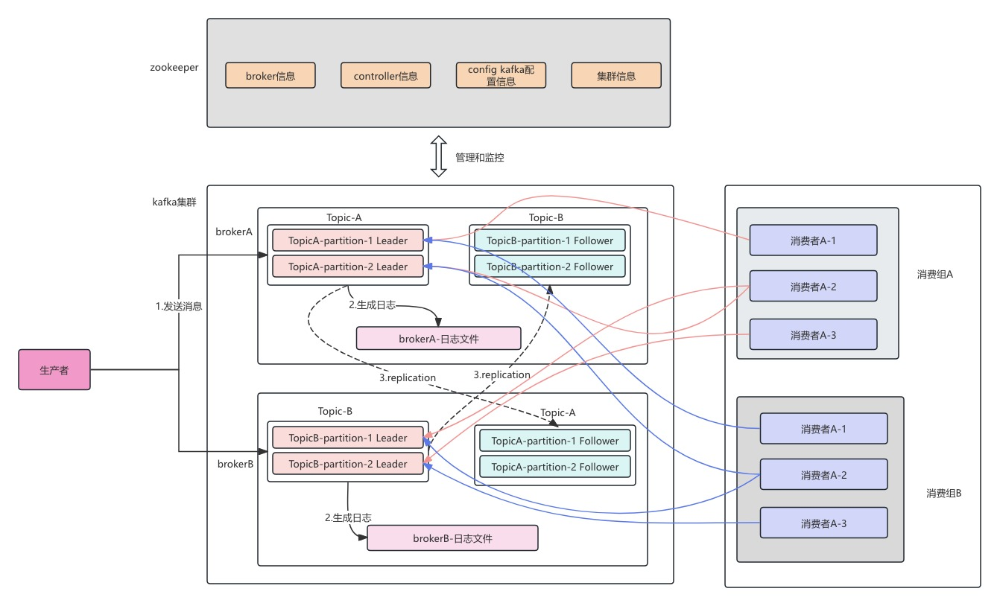
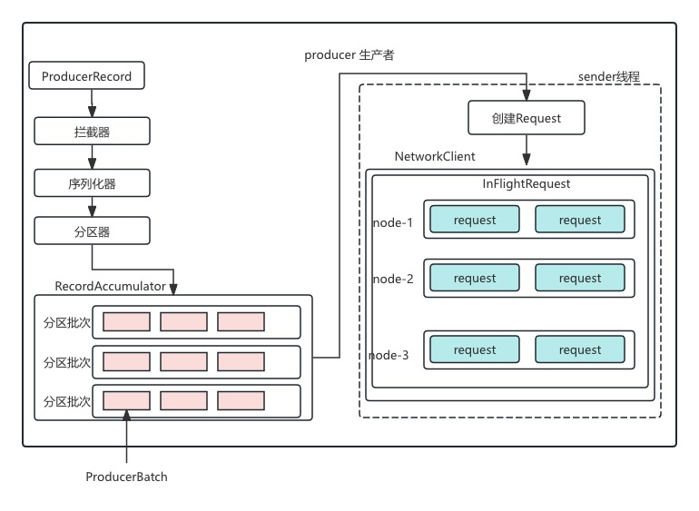
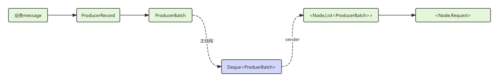
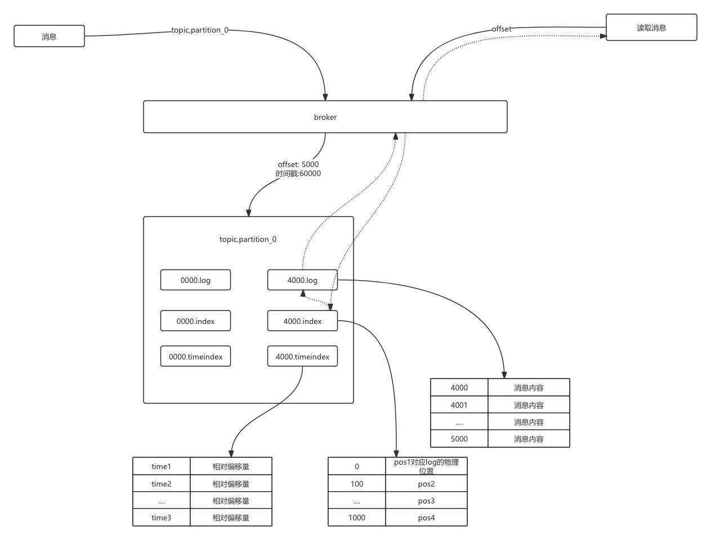

# Kakfa核心概念和架构

## 简介

### 什么是Kafka

> Kafka 是一个分布式的(Distributed)、分区的(partitioned)、复制的(replicated) 提交日志(commit log)服务 


### 整体架构




### 组件和核心概念

Kafka的基础组件主要有

- Broker  : kafka服务器节点,负责存储数据和处理消息
- Consumer : 消费者,从topic拉取数据消费
- Consumer Group: 多个消费者共同消费一个topic
- Producer: 消息生产者
- Topic : 消息主题，逻辑上的消息分类，每条消息属于一个 Topic
- Partition: Topic 的物理分区，每个 Topic 可分为多个 Partition，实现分布式存储
- Replica : Partition 的副本，用于数据冗余和高可用，分为 Leader 和 Follower

核心概念主要有

- 顺序读写
- 分区机制
- 副本机制
- 零拷贝


## 生产者原理介绍

### 生产者发送架构



生产者客户端主要有两个线程运行:

- 主线程:负责创建消息,存放到RecordAccumulator 即消息收集器
- sender线程:负责发送消息,即从RecordAccumulator中取出消息,发送到broker节点


说明:

```
RecordAccumulator 默认大小为32M
如果空间不足,发送客户端要么阻塞,要么抛出异常,阻塞时长有max.block.ms参数决定,默认为60s
```


### 发送者消息数据结构



数据流转说明:

```
- 业务message调用客户端发送函数
- 主线程会将该线程封装成ProducerRecord
- 然后进入RecordAccumulator 进行消息批次封装
- 首先主线程会从当前record对应的Deque获取一个ProducerBatch,查看当前ProduerBatch是否能够存下这个Record
  - 如果能存下,就将该record存入该ProducerBatch
  - 如果存不下,就创建一个ProducerBatch, batch的大小有batch.size控制
- sender线程会不停的从Deque中取ProducerBatch 然后保存成<Node,List<ProducerBatch>>形式,即:Broker节点-消息数据
- Sender线程会继续把<Node,List<ProducerBatch>> 转化成<Node,Request> ,然后将各个Request发送到对应的Node
- 在发送前会将<Node,Request>数据保存到InFlightRequests中,其中结构为<Node,List<Request>> ,
  - 主要作用是缓存已经发送出去,但是还没有收到相应的请求
  - 通过max.in.flight.requests.per.connection 默认为5,即每个连接最多能缓存5个请求
  - 超过这个限制,就不会继续发送请求
```


### 元数据

客户端会缓存kafka集群的元数据,这些元数据主要包括:

- 集群中的主题
- 主题的分区信息
- 每个分区的Leader副本在哪个节点、follower副本在哪些节点,哪些副本在AR,ISR等集合中
- 集群中有哪些节点
- 控制器节点是哪个


```
客户端定时更新元数据频率:

Metadata.max.age.ms:默认5分钟

元数据是有Sender线程负责更新的
```


## 服务端设计

服务端主要内容包括:

- 主题和分区
- 日志:消息读取和写入
- kafka协议
- 时间轮和延迟操作


### 主题和分区

主题是消息的归类,分区可以看作是消息的二次归类.

分区的划分不仅为Kafka提供了可伸缩性、水平扩展的功能,还通过多副本机制来为Kafka提供数据冗余,提高数据可靠性

从底层实现来说,主题和分区都是逻辑上的概念,分区可以有一至多个副本,每个副本对应一个日志文件,每个日志文件对应一至多个日志分段(LogSegement),每个日志分段还可以分为索引文件(.index, .timeindex),日志存储文件(.log),快照文件等.下面会介绍.


#### 分区选举

##### 简介

Kafka 采用 **Leader-Follower 复制模型**，每个分区有一个 Leader 副本负责读写请求，其他副本作为 Follower 同步数据。当 Leader 不可用时，需要从 Follower 中选举新的 Leader，这一过程称为**分区选举**。

##### 触发条件

1. **Broker 崩溃**：Leader 所在 Broker 宕机
2. **网络分区**：Leader 与 ZooKeeper/KRaft 失去连接
3. **手动操作**：通过命令强制重新选举 Leader
4. **分区重分配**：在分区副本迁移过程中可能触发 Leader 变更


1. **手动操作**：通过命令强制重新选举 Leader
2. **分区重分配**：在分区副本迁移过程中可能触发 Leader 变更

##### 选举的核心组件

###### Controller（控制器）

- **角色**：集群全局协调者，负责分区 Leader 选举
- **选举机制**：多个 Broker 竞争，第一个在 ZooKeeper（或 KRaft）创建 `/controller` 节点的成为 Controller
- 职责
  - 监听 Broker 状态变化
  - 执行 Leader 选举并通知相关 Broker
  - 更新集群元数据

###### ISR（In-Sync Replicas）

- **定义**：与 Leader 保持同步的副本集合

- 同步条件

  ：Follower 必须满足：

  - 定期向 Leader 发送 Fetch 请求（`replica.lag.time.max.ms`，默认 10000ms）
  - 落后 Leader 的消息条数不超过阈值（`replica.lag.max.messages`，默认无限制）

- **作用**：选举时优先从 ISR 中选择新 Leader，确保数据一致性

###### ZooKeeper/KRaft

- **ZooKeeper**（Kafka 2.8 及以前）：存储 Controller 信息、分区状态、ISR 列表等
- **KRaft**（Kafka 3.0+）：替代 ZooKeeper，使用 Raft 协议管理集群元数据


##### 选举策略

| 策略名称                | 说明                                                         | 风险点                                           |
| ----------------------- | ------------------------------------------------------------ | ------------------------------------------------ |
| **ISR 优先选举**        | 从 ISR 中选择第一个可用副本作为新 Leader                     | 若 ISR 为空，可能导致分区不可用                  |
| **Unclean Leader 选举** | 允许非 ISR 副本成为 Leader（需开启 `unclean.leader.election.enable`） | 可能导致数据丢失（非 ISR 副本可能落后于 Leader） |
| **受控关闭选举**        | Broker 正常关闭时，将 Leader 转移到其他 ISR 副本             | 减少 Broker 重启时的选举延迟                     |


#### 如何选择合适的分区数

没有固定答案.只能从某些角度来做具体的分析,最终还是要根据实际的业务场景、软件条件、硬件条件、负载情况等来做具体的考量.

性能测试工具:测试发送性能

##### 分区越多吞吐量越高吗?

不是.

一味的增加分区并不能使吞吐量得到提升,如果超过默认的配置值,可能会引起kakfa进程的崩溃.

本质上一个topic,多个分区,每个分区有多个文件,因为linux能够打开的文件数是有限的,所以分区、topic的数量也是有限的,太多会报错: too many open files


##### 考量因素

一般情况下,根据预估的吞吐量及是否与key相关的规则来设定分区数量.后期可以通过增加分区、增加broker或分区重分配等手段来进行.


准则: 建议将分区数设定为集群中broker的倍数,即假定集群中有3个broker节点,可设定分区数为3.6.9等,至于倍数选定需要参考预估的吞吐量.

不过当集群中broker节点很多时,比如大几十、上百、上千,就不适用了.


### 日志

#### 日志结构

Kafka-logs

- Topic_xxx
  - Partition-0(分区一)/
    - 数据段1.log
    - 数据段1.index
    - 数据段1.timeindex
    - 数据段2.log
    - 数据段2.index
    - 数据段2.timeindex
  - Partition-2(分区二)/
    - 数据段1.log
    - 数据段1.index
    - 数据段1.timeindex
    - 数据段2.log
    - 数据段2.index
    - 数据段2.timeindex

log文件为日志的数据文件,记录每一条日志,index为offset 索引文件,timeindex为时间戳文件

其中.index文件和.log文件的文件名都是当前第一条消息的偏移量

但是.timeindex文件为第一条消息的时间戳

#### 日志的写入和读取




##### 写入

消息在写入log日志时,kafka会有以下操作:

- 为每个消息生成一个offset,在topic内全局唯一、递增
- 查找当前日志的offset属于分区的那个段,计算相对于该段起始offset的相对offset
- 写入该段的log日志
  - log里面存储的是 绝对偏移量,即真实的offset
- 判断是否要更新index和timeindex
  - .index索引里面存储的是: 相对偏移量+log文件的物理位置
  - .timeindex索引:存储的是 时间戳+相对偏移量
  - 判断条件:
    - segment.index.bytes	:索引文件的大小
    - segment.index.interval.bytes 写入间隔,控制稀疏索引密度,4096,即过4096个消息后,写入一条索引
    - 
- 判断是否要创建新的日志段
  - 当前日志分段的大小加上消息大小超过日志分段的阈值:log.segment.bytes配置项
  - 离上次创建日志分段的时间到达一定需要滚动的时间log.roll.hours
  - 索引文件满了


#### 日志的清理

Kafka 的日志删除策略是其日志清理策略中的一种，用于控制消息的存储时间和清理方式，以释放磁盘空间，避免磁盘占用无限增长,策略如下:

- **清理时间间隔**：`log.retention.check.interval.ms` 用于设置专门的日志删除任务周期性检测的时间间隔，默认是 300000ms（5 分钟），即每隔 5 分钟检查一次日志分段文件是否符合删除条件。
- **按时间清理**：`log.retention.hours` 表示以小时为单位的保留时间，默认值为 168 小时（7 天）。也可以通过 `log.retention.minutes`（分钟）和 `log.retention.ms`（毫秒）来更精确地设置保留时间，优先级为 `log.retention.ms > log.retention.minutes > log.retention.hours`。当消息超过指定的保留时间，对应的日志分段会被删除。
- **按大小清理**：`log.retention.bytes` 用于配置每个日志分区允许使用的最大存储空间，默认值为 -1，表示无穷大。如果日志大小超过该配置，最早的消息对应的日志分段将被删除。需要注意的是，时间和大小限制是互斥的，Kafka 会依据首先满足的条件来清理日志。


## 消费端设计


### 分区分配策略


#### RangeAssignor(kafka默认策略)

分配策略:将给所有分区平均分配,然后剩余的按顺序分配给考前的分区.


假如目前有三个Topic,每个分区有三个分区,目前有一个消费者组,里面有两个消费者c1,c2

```
t0p0 t0p1 t0p2
t1p0 t1p1 t1p2
t2p0 t2p1 t2p2
则按照rangeAssignor分配策略 n = 3分区/2消费者 = 1 ,m = 3分区%2消费者 = 1 
所以对于前m个消费者分区数量为n+1 = 2 ,其余为n = 1;
所以
C1: t0p0,t0p1  t1p0 t1p1 t2p0 t2p1
C2: t0p2       t1p2      t2p2     


```


#### RoundRobinAssignor

该分配策略原理: 将消费组内所有消费者以及消费者订阅的所有主题的分区按照字典排序,然后通过轮询的方式逐个将分区依次分配给每个消费者

以上面为例则分配结果为:

```
C1: t0p0,t0p2,t1p1,t2p0,t2p2    
C2: t0p1,t1p0,t1p2,t2p1                
```


#### StickyAssignor分配策略

该策略的目的:

- 分区尽可能均匀
- 分区的分配尽可能和上次分配的情况保持一致

两者冲突时优先第一个.


# kafka高级特性

## 消息类型

### TTL消息

指定消息存在的时间

### 延迟消息

无,在kafka中没有原生支持延迟消息

### 事务消息

无


### 幂等性、Exactly-Once(精确一次消息投递)、事务

kafka实现Exactly-Once语义,主要有两种方式:

- 单分区: 通过幂等性实现
- 多分区: 通过事务+幂等性实现.


#### 幂等性实现原理

Kafka 的幂等性（Idempotence）是指生产者发送消息时，即使出现重试（如网络波动导致的发送失败），也不会导致消息在 Broker 中重复写入。这一特性从 Kafka **0.11.0.0**版本开始引入.

##### **幂等性的核心概念**

###### 1. **生产者 ID（Producer ID，PID）**

- 每个启用幂等性的生产者在初始化时，会从 Kafka 集群获取一个唯一的 PID。
- PID 对用户透明，由 Kafka 内部管理，用于标识生产者的身份。

###### 2. **序列号（Sequence Number）**

- 生产者为每个分区维护一个序列号（从 0 开始递增）。
- 每次向特定分区发送消息时，序列号会 + 1，并与消息一起发送到 Broker。

###### 3. **幂等性保证范围**

- **单分区内的幂等性**：Kafka 保证同一个 PID 发送到同一分区的消息不会重复。
- **单会话（Session）内有效**：若生产者重启，新会话会分配新 PID，之前的序列号失效。

##### **Broker 端的去重逻辑**

- **每个分区维护最高序列号**：Broker 为每个分区记录已接收的最大序列号（`lastSequence`）。
- 消息校验规则
  - 若新消息的序列号 ≤ `lastSequence`，则认为是重复消息，直接丢弃。
  - 若新消息的序列号 = `lastSequence + 1`，则正常写入。
  - 若新消息的序列号 > `lastSequence + 1`，则认为出现乱序（如生产者重试导致），Broker 会拒绝并抛出异常。


#### 事务

实现原理

- **事务协调器**：管理事务状态，将事务元数据存储在内部主题`__transaction_state`。
- **事务 ID（Transaction ID）**：唯一标识一组事务操作，确保生产者重启后仍能恢复状态。
- **原子提交**：通过`beginTransaction()`、`commitTransaction()`或`abortTransaction()`控制事务边界。


配置

```properties
enable.idempotence = true       # 必须启用幂等性
transactional.id = "my-txn-id"  # 指定唯一事务ID
```

本质上就是把幂等性的pid换成了事务id.


