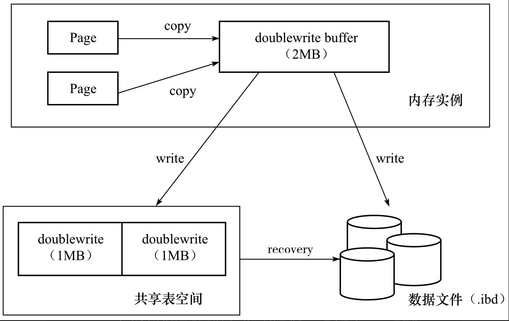
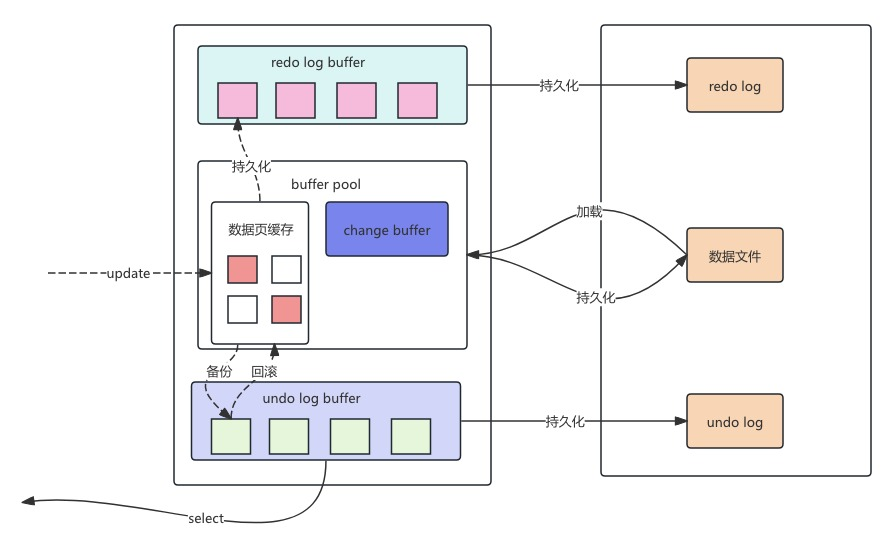
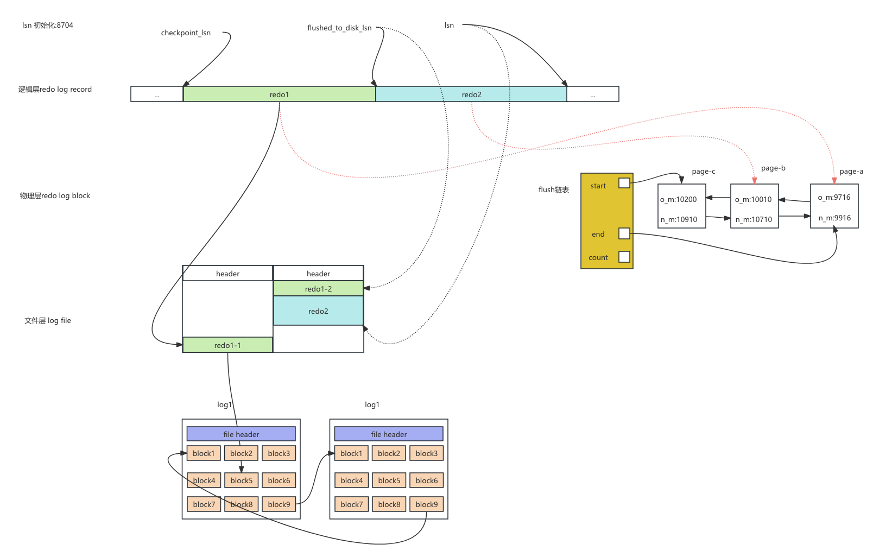

# 存储架构

## Innodb架构


innodb的架构整体来看,就是两层,一层缓存,一层数据文件.

缓存主要分为:

- Buffer pool
  - 索引缓存
  - Change buffer缓存
- Log buffer
  - redo log buffer
  - undo log buffer


## 缓存介绍

### Buffer pool 的作用

#### 定义

Buffer Pool 是 InnoDB 存储引擎用于缓存数据页和索引页的内存区域，减少磁盘 I/O。


#### 内存结构

Buffer pool的主要内容包括:

- 多个缓存页(默认16kb/页)组成,使用链表和哈希表管理

- 数据包括: 数据页、索引页、插入缓冲、自适应哈希索引、锁信息

  


#### 读写流程

读流程:

1. 查询数据时，先检查 Buffer Pool 是否存在目标页。
2. 存在则直接返回（缓存命中），否则从磁盘读取并缓存到 Buffer Pool。
3. 如果是非唯一二级索引,还会查看change buffer是否存在该页的修改,如果有,将会触发merge动作,将change buffer 的数据合并到当前数据页,并将当前数据页标记为dirty 有刷脏页线程处理,并且当前change buffer 被标记为已应用,这样,在刷新change buffer 到磁盘时就可以不处理


写流程: 涉及非唯一二级索引

- 检查buffer pool 中是否存在该数据页
  - 如果存在直接修改
  - 否则进入change buffer 流程
- 将操作封装成Insert Buffer Entry 存入change buffer
- 记录内容包括：
  - 索引页的物理位置（表空间 ID、页号）。
  - 索引键值（如 `name='Alice'`）。
  - 操作类型（INSERT/UPDATE/DELETE）
- 事务提交
  - 写操作在 Change Buffer 中记录后，事务即可提交（无需等待索引页刷新到磁盘）。
  - 同时生成对应的 redo log，确保 crash-safe。


### change buffer

#### 什么是change buffer

change buffer 的定义:

- 是 InnoDB 存储引擎的内存组件，属于 Buffer Pool 的一部分，用于缓存对**非唯一二级索引页**的写操作（INSERT/UPDATE/DELETE）。
- 设计目标：减少写操作时的随机 I/O（避免立即读取未在 Buffer Pool 中的索引页）。

适用条件

- 仅适用于**非唯一二级索引**（UNIQUE 索引因需立即校验唯一性，不使用 Change Buffer）。
- 索引页不在 Buffer Pool 中时触发缓存机制。

#### change buffer 的工作流程

上面的读写流程已经介绍

#### change buffer的合并机制

1. **触发时机**

   - 索引页被读取到 Buffer Pool 时

     ```sql
     -- 查询触发索引页读取，合并 Change Buffer 中的操作
     SELECT * FROM users WHERE name = 'Alice';
     ```

   - 后台线程定期合并

     - 由 `page_cleaner` 线程按 `innodb_io_capacity` 控制的速率合并。

   - 刷新脏页时

     - 当索引页因脏页刷新机制被写入磁盘前，必须先合并 Change Buffer 中的操作。

2. **合并流程**

   - 从磁盘读取目标索引页到 Buffer Pool。
   - 将 Change Buffer 中针对该页的所有操作按顺序应用到索引页。
   - 标记索引页为脏页，后续按脏页刷新策略写入磁盘。


#### change buffer 的参数优化

参考mysql优化


### Doublewrite buffer 两次写

#### 原理图




doublewrite 的结构分为两部分:

- buffer pool 中的doublewrite buffer 2M大小
- 共享表空间中的doublewrite文件也是2M大小


#### 工作原理

当要将buffer pool 中的脏页数据刷新到磁盘时,由于数据页大小一般为16kb,磁盘页大小有4k,所以一个数据页对应4个磁盘页,为了保证刷新的原子性,避免部分成功.

- 第一步先将buffer pool 的数据页copy 到 doublewrite buffer中,然后调用fsync函数,将这些数据分两次刷新到doublewrite 磁盘文件
- 第二步开始,执行buffer pool脏页刷新到磁盘各个表空间文件


#### 与redo log协作

redo log 只是记录物理页的修改,double wirte保存了损坏的物理页备份.

所有修复数据时,先用double write修复物理页,然后使用redo log 修复修改的数据.


## 索引

### 索引简介

InnoDB存储引擎支持以下几种常见的索引:

- B+树索引
- 全文索引
- 哈希索引

InnoDB支持的哈希索引是自适应哈希索引.不能够指定哈希索引.

**B+树索引是一个多路平衡树,并且索引只能定位到记录所在的页不是在行.**


### 索引的结构


#### B+树


#### 聚簇索引

聚簇索引的定义:

- 使用记录主键值的大小进行记录和页的排序,包含如下三个意思
  - 页内数据有序:页内的记录是按照主键的大小顺序排成一个单向链表
  - 页之间有序: 各个存放用户记录的页也是根据页中用户记录的主键大小顺序排成一个双向链表
  - 目录项页有序: 存放目录项记录的页分为不同的层次,在同一层次中的页也是根据页中目录项记录的主键大小顺序排成一个双向链表
- B+树的叶子节点存储的是完整的用户记录
  - 完整记录即该记录的所有列和隐藏列

#### 二级索引和联合索引

二级索引和联合索引我认为可以理解为一个,只不过二级索引一般是单列,联合索引是多列.

数据结构和聚簇索引一样

只不过有以下区别:

- 搜索key由主键变成了索引列
- 排序是按照索引列的值进行排序如 index(a,b,c)先按a排序,再按b排序,再按c排序


#### 注意事项

- 索引的根页面是不变的
- 二级索引、联合索引的目录项的值是唯一的,包含了主键值,如索引(a,b) 如果再来了a,b相同的值如何查询,所以排序时加上了主键id,a,b相同再根据主键id排列.
- 一个页面最少有两条记录


### 索引的使用

#### 创建索引的建议

创建索引时应考虑以下内容

- 索引列的区分度,参考Cardinality

- 只为搜索、排序、分组的列创建索引

- 列的类型尽量小

- 索引字符串值的前缀

- 让主键自己插入索引,自己定义业务主键

- 索引列在表达式中单独存在

- 注意索引的冗余和重复

  

#### 索引的适用条件

索引的适用条件,以索引 idx_a(a,b,c)

- 全值匹配,如a =1 ,b=2,c=3 和顺序无关
- 最左匹配原则: a = 1 或者 a=1 ,b=2  
- 匹配列前缀 like 'a%'
- 匹配范围
- 精确匹配某一列并范围匹配另外一列
- 排序 按索引列的排序查找
- 分组,按照索引列进行分组查询


索引排序不适用的情况

- ASC、DESC混用

- where条件存在非索引列

- 排序列不是同一个索引

- 使用复杂表达式

  


##### 最左列匹配原则:

示例: 假如我表post的索引  idx1(userId,postStatus,postType ,parentPostId)

```
查询语句:
explain select * from post where userId= 1 and postType= 10;
是否走索引
```

```
[
  {
    "id": 1,
    "select_type": "SIMPLE",
    "table": "post",
    "partitions": null,
    "type": "ref",
    "possible_keys": "idx1,idx2",
    "key": "idx1",
    "key_len": "4",
    "ref": "const",
    "rows": 2,
    "filtered": 10,
    "Extra": "Using index condition"
  }
]
```

这是执行了explain的结果,我个人理解是走了索引.并且使用了ICP(Using index condition)

##### 匹配范围值

```
查询语句:
explain select * from post where userId>10 and userId<100 and postType= 10;
是否走索引
```

explain情况和上面相同,也是ICP


#### Cardinality

##### 定义:

Cardinality 表示索引中唯一值的数量，反映字段的 “区分度”。例如，若字段 `id` 有 1000 个唯一值，则其 Cardinality 为 1000。

##### 核心作用:

- 帮助 MySQL 优化器判断索引的效率，决定是否使用索引及使用方式。
- 基数越高（唯一值越多），索引过滤效果越好，查询效率越高。


##### 查看方式

```sql
EXPLAIN SELECT * FROM table_name WHERE column = 'value';

在输出结果的 Key 列（使用的索引）和 Key_len 列（索引长度）旁，Rows 列会显示优化器估算的扫描行数，其估算基于 Cardinality。

show index from table名称

-- 查看指定表的所有索引基数
SELECT TABLE_NAME, INDEX_NAME, COLUMN_NAME, CARDINALITY
FROM INFORMATION_SCHEMA.STATISTICS
WHERE TABLE_NAME = 'table_name'
ORDER BY CARDINALITY DESC;
```

可以查看该表中各个索引的区分度


### 回表

回表的含义:通过索引查询到主键,然后再通过聚簇索引查询到记录的


覆盖索引:

```
如果我们不需要全部记录,而只需要索引列的值,就尽量不要写select * from table where  索引值匹配

而是 select 索引列 from table where 索引值匹配
```


### MySQL索引的优化

#### ICP(Using index condition)

**"Using index condition"** 是 MySQL 5.6 引入的一项索引优化技术，也称为**索引条件下推（Index Condition Pushdown, ICP）**。其核心作用是减少回表次数，提升查询效率。

传统查询:

```
1. 通过索引定位主键值
2. 回表（通过主键）读取完整数据行
3. 过滤剩余条件（如WHERE中的非索引列条件）
```

使用ICP查询

```
1. 通过索引定位主键值
2. **在索引中先过滤部分条件**（如索引包含的列）
3. 仅对满足条件的记录回表读取完整数据
```

##### **ICP 适用条件**

1. **索引覆盖部分条件**：
   - 查询条件中部分字段存在于索引中，部分不在。
   - 示例：索引为 `(a, b)`，查询 `WHERE a=1 AND c>10`（`c` 不在索引中）。
2. **二级索引**：
   - 聚簇索引（主键）已包含所有列，ICP 对其无优化效果。
   - 仅对二级索引（如普通索引、唯一索引）生效。
3. **存储引擎**：
   - 仅 InnoDB 和 MyISAM 支持 ICP，Memory 引擎不支持。

##### **、EXPLAIN 中的 ICP 标识**

通过 `EXPLAIN` 查看执行计划，若出现 **"Using index condition"**，表示启用了 ICP：


### MyISAM中的索引

MyISAM中索引特点:

- 索引和数据分开,即使是主键
- 索引里面存储主键+行号
- 数据文件里面行号+记录


## 事务

### 事务简介

#### 定义

```


数据库事务（Database Transaction）是一组逻辑上的数据库操作单元，这些操作要么全部成功执行，要么全部失败回滚，确保数据库从一个一致性状态转换到另一个一致性状态。事务是数据库管理系统（DBMS）实现数据完整性和一致性的核心机制，尤其在多用户并发访问或系统故障时，能保证数据的可靠性。
```

#### 事务具有以下四大特性:AICD

| **特性**                  | **英文全称** | **核心含义**                                                 | **MySQL 实现方式**                                           |
| ------------------------- | ------------ | ------------------------------------------------------------ | ------------------------------------------------------------ |
| **原子性（Atomicity）**   | Atomicity    | 事务中的操作要么全部成功，要么全部回滚，不存在中间状态。     | - 通过 undo 日志记录事务操作前的状态，回滚时恢复数据； - InnoDB 的事务回滚机制。 |
| **一致性（Consistency）** | Consistency  | 事务执行前后，数据库始终满足完整性约束（如主键唯一、外键关联等）。 | - 结合原子性、隔离性和持久性共同保证； - 依赖数据库模式（Schema）的约束定义。 |
| **隔离性（Isolation）**   | Isolation    | 多个事务并发执行时，彼此互不干扰，避免数据读取或修改冲突。   | - 通过锁机制（共享锁 / 排他锁）和 MVCC（多版本并发控制）实现； - 支持 4 种隔离级别。 |
| **持久性（Durability）**  | Durability   | 事务提交后，数据修改永久保存，即使系统故障也不丢失。         |                                                              |


#### MySQL实现ACID的原理

- 原子性
  - undo log日志
  - 事务日志机制
- 一致性
  - 约束校验: DDL定义的约束
  - 原子性、隔离性、持久性的结果
- 隔离性
  - MVCC
  - 锁
- 持久性
  - WAL: 事务提交前,先将redo日志写入磁盘,再修改数据页
  -  redo log日志:记录数据修改后的新值,奔溃恢复使用
  - 刷盘策略


Undo log 和Redo log的区别:

- undo log保存修改前的数据,保证数据原子性问题
- redo log保存了事务中的修改情况,即修改之后的样子,保证数据持久性问题


### Redo log & undo log

#### 工作原理




#### Redo log 工作原理



首先redo的工作我理解可以分为三大步:

- 生成redo log 记录,并写入redo log block (redo log buffer)
- 将redo log buffer 中的block的记录 刷新到磁盘,记录到物理日志里面
- Checkpoint 决定那些redo log buffer 和redo log 的内容是可以覆盖的

##### 三个LSN

这三步会生成三个数据: LSN, flushed_to_disk_lsn , checkpoint_lsn

- LSN:代表当前系统中最大的redo log record 序号
- Flushed_to_disk_lsn 代表已经写入到磁盘的最大lsn序号
- checkpoint_lsn代表buffer pool中脏页刷新到磁盘,最大的lsn序号

lsn和flushed_to_disk_lsn好理解一些,checkpoint_lsn说明如下:

假如当前事务trx1 ,生成的redo log 记录为redo1 ,修改对应的buffer pool 数据页为page-a,这时lsn假如为9716,假如这时flush链表为空,

则会生成一个控制块a,其中o_m代表页a最早的修改lsn,并插入到flush链表

后续会发生如下情况:

- 事务trx2 并发修改数据页a,lsn为9916,修改完后,发现链表有页a对应的控制块,则直接更新n_m即最新的lsn为9916
- 事务trx3生成redo2,修改buffer pool 数据页b,这时lsn = 10010,则数据页b的控制块b的o_m=10010,并将b插入到a的前面
- 依次类推


后台线程会对flush链表进行刷脏操作,假如把页a的数据刷新到磁盘数据文件,这时a的控制块就没用,这时redo log的checkpoint_lsn就变成了9716,

因为flush链表是有序的,所以小于9716的数据已经被刷新到磁盘了,所以对应的redo log也可以被覆盖了,

随着后台线程不停的刷新flush链表,checkpoint_lsn会越来越接近flushed_to_disk_lsn.


##### redo log刷盘时机

- Log buffer 空间不足时
- 事务提交时
- 后台线程
- 政策关闭服务器

> 其中事务提交时的刷盘策略选择:
>
> innodb_flush_log_at_trx_commit的用法 我们前边说为了保证事务的持久性，用户线程在事务提交时需要将该事务执行过程中产生的所有redo日志都刷新到磁盘上。这一条要求太狠了，会很明显的降低数据库性能。如果有的同学对事务的持久性要求不是那么强烈的话，可以选择修改一个称为innodb_flush_log_at_trx_commit的系统变量的值，
>
> 该变量有3个可选的值: 
>
> 0:当该系统变量值为0时，表示在事务提交时不立即向磁盘中同步redo日志，这个任务是交给后台线程做的。 这样很明显会加快请求处理速度，但是如果事务提交后服务器挂了，后台线程没有及时将redo日志刷新到磁盘，那么该事务对页面的修改会丢失。
>
>  1:当该系统变量值为1时，表示在事务提交时需要将redo日志同步到磁盘，可以保证事务的持久性。1也是innodb_flush_log_at_trx_commit的默认值。
>
>  2:当该系统变量值为2时，表示在事务提交时需要将redo日志写到操作系统的缓冲区中，但并不需要保证将日志真正的刷新到磁盘。 这种情况下如果数据库挂了，操作系统没挂的话，事务的持久性还是可以保证的，但是操作系统也挂了的话，那就不能保证持久性了。


## 锁


## 优化点

除了在缓存层面,innnodb做的优化,还有以下优化点.


### 异步IO


## 刷新临近页

Flush Neighbor Page(刷新临近页):当刷新一个脏页时,Innodb 存储引擎会检测该页所在区的所有页,如果是脏页,那么一起刷新.这样做的好处是通过AIO将多个IO写入操作合并成一个IO操作.

但是有两个问题可以考虑:

- 是不是可能将不怎么脏的页进行写入,之后该页又很快变脏页
- 固态硬盘有着较高的IOPS,是否还需要这个特性


InnoDB存储引擎从1.2.x版本提供Innodb_flush_neighbors参数可以关闭该功能


1. 


