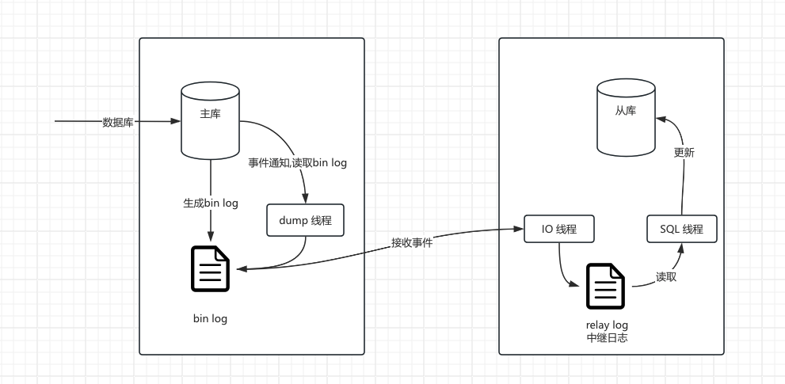

# MySQL基础知识


# MySQL架构

## 架构说明


## sql执行过程

### select执行过程

select 普通查询sql执行过程如下:

- sql有客户端发送到服务端
- 查询缓存
  - 如果query cache查询缓存开启
  - key语句,value缓存结果,查询该sql是否执行过
  - **查询缓存通常弊大于利**。查询缓存失效率较高。每当对表进行更新时，该表的所有相应查询缓存条目都会失效并被清除。因此，存储结果所付出的努力可能是徒劳的，因为它们可以通过一次更新来清除。对于更新压力较高的数据库，查询缓存命中率可能会非常低。它仅在您拥有很少更新的静态表的情况下才有用。
- Parser 解析器:解析语法结构
- Optimizer优化器: 优化器的主要作用是选择索引和表的连接顺序,确定执行计划
- Executor执行器执行sql
  - 首先检查表的权限,如果没有返回权限不足的错误
  - 打开表
  - 调用引擎如innodb提供的接口获取扫描的第一行数据,匹配条件是否满足,如果满足加入结果集
    - 无索引,调用表的第一行接口
    - 有索引,调用符合条件的第一行的接口
  - 如果不符合,调用下一行
  - 直至扫描了所有的行


### update执行过程


update语句执行流程如下:

- 客户端发送SQL到Server层连接器
- 解析器,对该语句进行解析,验证权限是否有权限操作(这里主要是表权限和操作权限)
- 分析器进行语法分析, 是否有语法错误
- 优化器生成执行计划, 并打开表,如果该表有DML操作,需要等待
- 执行器调用引擎层接口,
  - 在server层还会失效该表的查询缓存
- 查找该语句对应的数据记录,
  - 如果这些记录未在buffer pool 中,则将数据从磁盘加载到buffer pool 中,即buffer pool中的data page
- redo log 和undo log 
  - 将要修改的记录旧值保存到buffer pool 中undo log 的内存区域,也是链表
  - 生成redo log buffer数据内容,并设置状态未prepare
- 在data page中修改数据内容
  - 如果该记录涉及非唯一索引,则要修改的非唯一索引,暂存change buffer
    - 下次读取该二级索引时,进行merge操作
- 记录修改信息,按照bin log event格式,记录到bin log cache中,事务提交后,由dump线程发送到slave的IO线程
- update语句执行完成,执行commit 或者rollback操作
- update执行commit
  - 将redo log buffer的数据进行commit,并根据innodb_flush_log_at_trx_commit 选项执行操作
    - 0: 事务提交不立即向磁盘同步redo日志,后台任务去做
    - 1: 事务提交时向磁盘同步,默认值
    - 2: 事务提交时需要将redo log写到系统的缓冲区,并不需要真正写到磁盘
  - bin log sync操作,sync_binlog默认为1
    - sync_binlog=0，禁用事务提交时bin log 同步到磁盘. 依赖操作系统去刷新到磁盘.好处: 最佳性能,坏处: 电源故障等发生时,事务已经提交,但是未同步bin log.
    - sync_binlog=1，事务提交时,同步到磁盘. 增加磁盘的写入次数. 因为电源事故或者突然崩溃事故, 自动恢复程序可以自动会滚事务,丢失的bin log都是prepare的
    - sync_binlog=n，n非0和1.代表n个事务提交后,同步磁盘. 如果磁盘写入增加,可能会产生负面影响,值越高,性能越高,但丢数据风险也就越高


## InnoDB结构和缓存

### InnoDB的结构


### Buffer pool


### Log Buffer


### DoubleWrite Buffer

#### 简介

DoubleWrite Buffer 时MySQL innodb存储引擎的一种机制,用于解决buffer pool 同步到磁盘时的一致性问题,提高数据完整性和可靠性.

DoubleWrite Buffer分为两部分:内存+磁盘文件.

- 内存: 由128个MySQL页组成,大小为2MB
- 磁盘结构
  - 8.0.20之前位于Innodb系统表空间
  - 8.0.20之后位于doublewrite文件(可以指定目录)

MySQL是默认开启DoubleWrite buffer功能


#### 工作原理


# 索引


## 什么是索引


## 索引的分类


## 索引的数据结构


## 怎么创建索引


## 索引的使用


# MySQL的锁

## MySQL中的锁介绍


## Innodb行锁


# 事务

## 事务的隔离级别


## 事务ACID实现原理


## MySQL RR级别能解决幻读吗


# MySQL集群架构

## 复制的原理

### 复制简介

> 复制解决的基本问题是让一台服务器的数据与其他服务器保持同步.


MySQL 支持两种复制方式: 基于行的复制和基于语句的复制. 这两种方式都是通过在主库记录bin log日志,然后同步到从库,在从库重放bin log日志,来实现的异步的数据复制.所以这意味着,主从架构异步复制的方式会有短暂的数据不一致,当前这个时间可大可小,受限制于网络、语句大小等.


### 复制的工作流程

复制有三个步骤:

-  主服务器生成bin log
-  从库将主库上的bin log 复制到自己的中继(relay log)日志
-  从库读取中继日志中的事件,将其重放到从库数据之上


### 复制数据格式

#### 基于语句的复制

> --binlog-format=STATEMENT

基于语句的复制原理是: 主库会记录写操作的sql(insert\delete\update) ,从库同步日志后,再执行一遍SQL.

**优点:**  日志比较紧凑、日志比较小,不会占用太多带宽. mysqlbinlog工具就是基于语句复制实现的工具.

**缺点:**

-  同一条日志在主库、从库的执行结果可能不同,如时间戳问题
-  sql执行必须串行.


#### 基于行的复制

> --binlog-format=ROW

基于行的复制: 记录并复制数据变更的具体行.


#### 混合日志记录

> --binlog-format=MIXED

默认情况下使用基于语句的日志记录，但在某些情况下，日志记录模式会自动切换到基于行的日志记录，


### 复制的模式




MySQL 主从复制默认是异步的模式。MySQL增删改操作会全部记录在 Binlog 中，当 slave 节点连接 master 时，会主动从 master 处获取最新的 Binlog 文件。并把 Binlog 存储到本地的 relay log 中，然后去执行 relay log 的更新内容。通过位点同步的原理如下：

**1、**主库会生成多个 binlog 日志文件。

**2、**从库的I/O 线程请求指定文件和指定位置的 binlog 日志文件（位点）。

**3、**主库 dump 线程获取指定位点的 binlog 日志。

**4、**主库按照从库发送给来的位点信息读取 binlog，然后推送 binlog 给从库。

**5、**从库将得到的 binlog 写到本地的 relay log (中继日志) 文件中。

**6、**从库的 SQL 线程读取和解析 relay log 文件。

**7、**从库的 SQL 线程重放 relay log 中的命令。

当我们使用位点同步的方式时，两种场景下的操作步骤比较复杂。

**存在痛点**

痛点1：首次开启主从复制的步骤复杂

- 第一次开启主从同步时，要求从库和主库是一致的。
- 找到主库的 binlog 位点。
- 设置从库的 binlog 位点。
- 开启从库的复制线程。

痛点2：恢复主从复制的步骤复杂

- 找到从库复制线程停止时的位点。
- 解决复制异常的事务。无法解决时就需要手动跳过指定类型的错误，比如通过设置slave_skip_errors=1032,1062。当然这个前提条件是跳过这类错误是无损的。（1062 错误是插入数据时唯一键冲突；1032 错误是删除数据时找不到行）


#### 异步模式

默认情况下主从复制的是异步的.

异步一: dump 异步即主库写入bin log变更后,通知 dump 线程,将变更事件通知给从库IO线程

异步二: 从库IO线程收到事件后,将事件顺序写入到relay log (中继日志),然后SQL异步读取将变更更新到从库

#### 同步模式

MySQL 主库提交事务的线程要等待所有从库的复制成功响应，才返回客户端结果。这种方式在实际项目中，基本上没法用，原因有两个：一是性能很差，因为要复制到所有节点才返回响应；二是可用性也很差，主库和所有从库任何一个数据库出问题，都会影响业务。


#### 半同步模式

**该模式可以解决异步复制的数据丢失问题**

MySQL 5.7 版本之后增加的一种复制方式，介于两者之间，事务线程不用等待所有的从库复制成功响应，只要一部分复制成功响应回来就行，比如一主二从的集群，只要数据成功复制到任意一个从库上，主库的事务线程就可以返回给客户端。这种**半同步复制的方式，兼顾了异步复制和同步复制的优点，即使出现主库宕机，至少还有一个从库有最新的数据，不存在数据丢失的风险**。


在master执行完毕后，commit之前，slave的io进程开始把Binlog写入到relaylog中，写完之后，反馈给master，master收到任何一个slave的反馈后，执行commit并返回结果给客户端。半同步的机制减少了主从数据不同步的问题，但是也牺牲了一部分主库的性能，比异步复制至少多了一个tcp的往返时间。


#### 延迟模式

在异步复制基础上,人为设定主库和从库的数据同步延迟时间.


### GTID

> GTID : 全局事务标识符
>
> GTID的主要目的是简化主从复制的管理,提高数据复制的可靠性和效率

#### 什么是GTID

`GTID` 指的是全局事务 ID，全称是 `Global Transaction Identifier`，具有如下特点：

- GTID事务是全局唯一性的，并且一个事务对应一个GTID值。
- 一个GTID值在同一个MySQL实例上只会执行一次。

GTID 由 `server_uuid` + `tid` 组成，其中：

- **server_uuid：** `server_uuid` 是在 Mysql 首次启动过程中自动生成的一个 `uuid(128位)` 随机值，生成后会将该值存储到数据目录的`auto.cnf`文件中。
- **tid：** 代表了该实例上已经提交的事务数量，并且随着事务提交单调递增，所以GTID能够保证每个MySQL实例事务的执行（不会重复执行同一个事务，并且会补全没有执行的事务）。

其组成样式如下：

```
 26630fed-fe68-11ec-b051-000c29509871:1-27
```

#### GTID 复制模式

为了解决基于 Binlog 复制模式的痛点，于是在 MySQL 5.6 里面，提供了新的数据恢复思路，这就是基于GTID的复制模式。MySQL能够通过内部机制 GTID 自动找点同步，并且通过 GTID可以保证每个主库提交的事务在集群中都有唯一的一个事务ID，强化了数据库主从的一致性和故障恢复数据的容错能力，在主库宕机发生主从切换的情况下，GTID方式可以让其他从库自动找到新主库复制的位置。而且GTID可以忽略已经执行过的事务，减少了数据发生错误的概率。GTID 同步的原理如下：

- 主节点执行事务提交前会产生一个 `GTID`，其会随着事务一起记录到 `binlog` 日志中。
- 从节点 `I/O Thread` 会读取主节点的 `binlog` 日志文件并存储在从节点的 `relaylog` 日志中。从节点将主节点的 `GTID` 这个值配置到 `gtid_next` 中，即下一个要读取的 GTID 值。
- 从节点SQL线程从relay log中读取 `gtid_next` 中的值，然后查找自己的 `binlog` 日志中是否有这个 `GTID`。
- 如果有这个记录，说明这个 `GTID` 的事务已经执行过了，就忽略掉。
- 如果没有这个记录，从节点会从relay log中执行该GTID的事务，并记录到自己的 `binlog` 日志中。同时在读取执行事务前会先检查其他 `session` 中是否持有该 `GTID`，确保不被重复执行。

#### GTID相较与传统复制的优势

- 主从搭建更加简便，不用手动特地指定position位置。
- 复制集群内有一个统一的标识，识别、管理上更方便。
- 故障转移failover更容易，不用像传统复制那样需要找 log_File 和 log_Position的位置。
- 通常情况下GTID是连续没有空洞的，更能保证数据的一致性。
- 相对于ROW复制模式，数据安全性更高，切换更简单。
- 比传统的复制更加安全，一个GTID在一个MySQL实例上只会执行一次，避免重复执行导致数据混乱或者主从不一致。

#### GTID 使用中的限制条件

GTID 复制是针对事务来说的，一个事务只对应一个 GTID，好多的限制就在于此。其中主要限制如下：

- 在一个复制组中，必须要求统一开启GTID或者是关闭GTID。
- 开启GTID需要重启(5.7除外)
- 不支持 `create table table_name select * from table_name`语句复制。

> 原理：
>
> 会生成两个sql，一个是DDL创建表SQL，一个是insert into 插入数据的sql。由于DDL会导致自动提交，所以这个sql至少需要两个GTID，但是GTID模式下，只能给这个sql生成一个GTID )

- 不允许在一个事务中既包含事务表（使用 `InnoDB` 存储引擎的表）的操作又包含非事务表（使用 `MyISAM` 存储引擎的表）。
- 不支持创建或删除临时表操作，如 `CREATE TEMPORARY TABLE or DROP TEMPORARY TABLE` 语句操作。
- 使用 GTID 复制从库跳过错误时，不支持执行该 `sql_slave_skip_counter` 参数的语法，传统复制可以使用这个命令跳过事务。

## 集群架构模式

## 星型拓扑

待补充


## 链式拓扑

待补充


