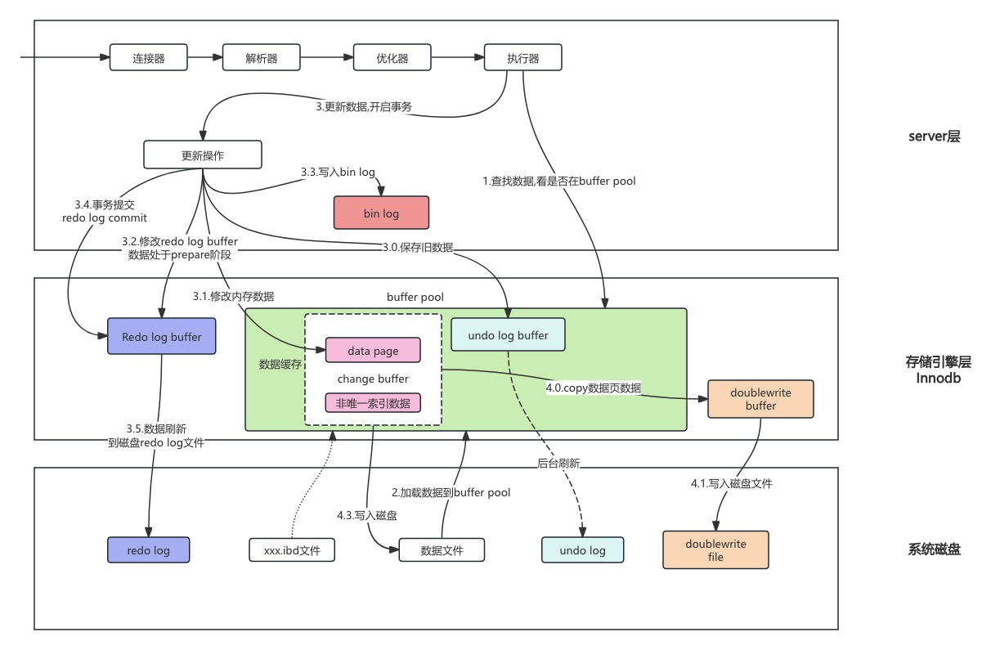

# MySQL基础知识

# MySQL架构

## 架构说明

## sql执行过程

### select执行过程

select 普通查询sql执行过程如下:

- sql有客户端发送到服务端
- 查询缓存
  - 如果query cache查询缓存开启
  - key语句,value缓存结果,查询该sql是否执行过
  - **查询缓存通常弊大于利**。查询缓存失效率较高。每当对表进行更新时，该表的所有相应查询缓存条目都会失效并被清除。因此，存储结果所付出的努力可能是徒劳的，因为它们可以通过一次更新来清除。对于更新压力较高的数据库，查询缓存命中率可能会非常低。它仅在您拥有很少更新的静态表的情况下才有用。
- Parser 解析器:解析语法结构
- Optimizer优化器: 优化器的主要作用是选择索引和表的连接顺序,确定执行计划
- Executor执行器执行sql
  - 首先检查表的权限,如果没有返回权限不足的错误
  - 打开表
  - 调用引擎如innodb提供的接口获取扫描的第一行数据,匹配条件是否满足,如果满足加入结果集
    - 无索引,调用表的第一行接口
    - 有索引,调用符合条件的第一行的接口
  - 如果不符合,调用下一行
  - 直至扫描了所有的行

### update执行过程

update语句执行流程如下:

- 客户端发送SQL到Server层连接器
- 解析器,对该语句进行解析,验证权限是否有权限操作(这里主要是表权限和操作权限)
- 分析器进行语法分析, 是否有语法错误
- 优化器生成执行计划, 并打开表,如果该表有DML操作,需要等待
- 执行器调用引擎层接口,
  - 在server层还会失效该表的查询缓存
- 查找该语句对应的数据记录,
  - 如果这些记录未在buffer pool 中,则将数据从磁盘加载到buffer pool 中,即buffer pool中的data page
- redo log 和undo log 
  - 将要修改的记录旧值保存到buffer pool 中undo log 的内存区域,也是链表
  - 生成redo log buffer数据内容,并设置状态未prepare
- 在data page中修改数据内容
  - 如果该记录涉及非唯一索引,则要修改的非唯一索引,暂存change buffer
    - 下次读取该二级索引时,进行merge操作
- 记录修改信息,按照bin log event格式,记录到bin log cache中,事务提交后,由dump线程发送到slave的IO线程
- update语句执行完成,执行commit 或者rollback操作
- update执行commit
  - 将redo log buffer的数据进行commit,并根据innodb_flush_log_at_trx_commit 选项执行操作
    - 0: 事务提交不立即向磁盘同步redo日志,后台任务去做
    - 1: 事务提交时向磁盘同步,默认值
    - 2: 事务提交时需要将redo log写到系统的缓冲区,并不需要真正写到磁盘
  - bin log sync操作,sync_binlog默认为1
    - sync_binlog=0，禁用事务提交时bin log 同步到磁盘. 依赖操作系统去刷新到磁盘.好处: 最佳性能,坏处: 电源故障等发生时,事务已经提交,但是未同步bin log.
    - sync_binlog=1，事务提交时,同步到磁盘. 增加磁盘的写入次数. 因为电源事故或者突然崩溃事故, 自动恢复程序可以自动会滚事务,丢失的bin log都是prepare的
    - sync_binlog=n，n非0和1.代表n个事务提交后,同步磁盘. 如果磁盘写入增加,可能会产生负面影响,值越高,性能越高,但丢数据风险也就越高

