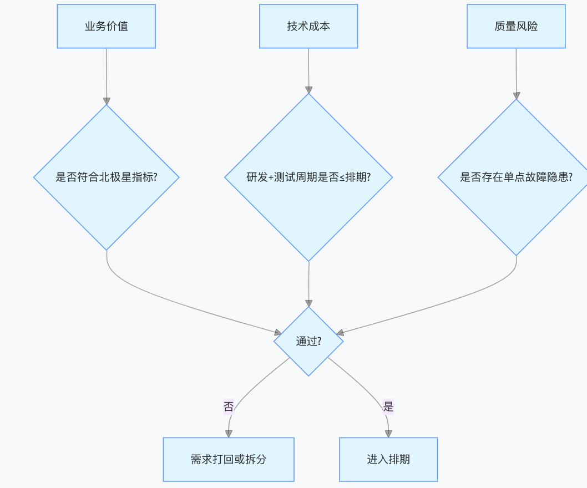
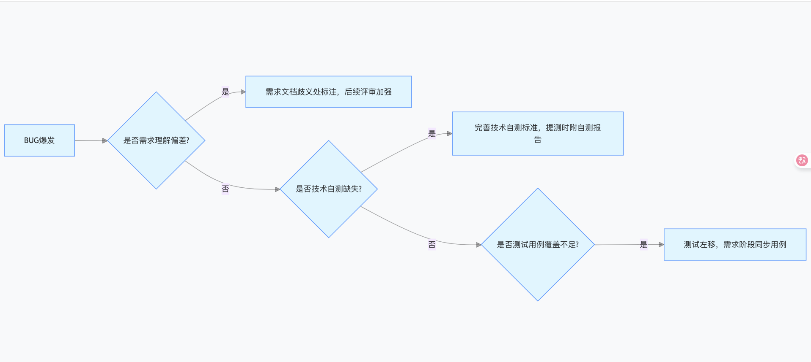

# 跨部门团队协作

在技术管理场景中，程序员管理者与产品、测试的协作效率直接影响项目交付质量与团队效能。以下从协作核心原则、关键流程优化、冲突解决策略及实战案例四个维度，结合跨职能协作的痛点与最佳实践展开分析：

### **一、协作底层逻辑：建立跨职能共识**

#### 1. **目标对齐：用业务指标统一认知**

- **案例**：某电商中台团队曾因技术追求 “高可用架构” 与产品 “快速迭代” 目标冲突，导致需求延期。后通过统一北极星指标（如 “订单转化率提升 15%”），技术方案聚焦 “优化结算页加载速度”，产品优先级调整为 “先实现核心支付流程，二期再优化边缘功能”，最终目标达成率提升 40%。

- 工具推荐

  ：使用 OKR 框架对齐目标，例如：

  - **产品 OKR**：O=Q3 将核心功能用户留存率从 25% 提升至 30%，KR = 完成 A/B 测试模块迭代
  - **技术 OKR**：O = 支撑产品目标并降低故障率，KR = 接口响应时间中位数控制在 500ms 内
  - **测试 OKR**：O = 保障迭代质量，KR = 自动化测试覆盖率从 60% 提升至 75%

#### 2. **角色权责清晰化：避免职责模糊地带**

- 跨职能 RACI 矩阵示例

  | 任务环节     | 产品经理（P） | 技术管理者（T） | 测试负责人（Q） |
  | ------------ | ------------- | --------------- | --------------- |
  | 需求评审     | R（负责）     | A（审批）       | I（知情）       |
  | 技术方案设计 | I             | R               | C（咨询）       |
  | 测试用例设计 | C             | I               | R               |
  | 线上故障处理 | I             | R               | A（确认修复）   |

- **关键原则**：每个决策点必须明确唯一责任人（R），避免 “多头决策” 导致的效率低下。

#### 3. **建立共同语言：消除术语壁垒**

- 技术→产品翻译对照表

  | 技术术语   | 产品可理解表述               |
  | ---------- | ---------------------------- |
  | 分布式事务 | “多模块数据同步的一致性保障” |
  | 接口限流   | “防止用户过多导致系统卡顿”   |
  | 灰度发布   | “先让 10% 用户试用新功能”    |

- 测试→技术协作话术优化

  - 差：“这个功能有 bug！”
  - 优：“在 3G 网络下点击提交按钮，页面出现 500 错误，复现步骤是…，影响用户支付流程”

### **二、全流程协作优化：从需求到上线**

#### **1. 需求阶段：避免 “拍脑袋” 导致的返工**

- 三方需求评审会规范：

  - **会前**：产品提前 2 天发送需求文档，技术标注 “需澄清点”（如 “该功能日活用户量预估？”），测试标注 “验收标准缺失项”（如 “未定义异常网络下的处理逻辑”）
  - 会中:如下图
  - 会后：输出《需求共识备忘录》，明确：
    - 产品：需求优先级（P0/P1/P2）、验收标准
    - 技术：关键技术方案、依赖项（如需要第三方接口支持）
    - 测试：特殊测试场景（如压测、兼容性测试）

  

  

#### **2. 开发阶段：建立实时同步机制**

- 每日站会优化版（10 分钟）

  - 产品：今日需跟进的需求变更点（如 “用户反馈列表页加载慢，需优先优化”）
  - 技术：阻塞问题（如 “支付接口联调受阻，需产品协调第三方对接”）
  - 测试：已发现的风险（如 “新功能与老版本存在兼容性问题，需技术评估”）

- 技术 & 测试协作关键点

  - TDD（测试驱动开发）：测试提前编写单元测试用例，技术按用例开发，

  - 技术自测标准

    ：每个提测功能需通过 “技术自测四步法”：

    1. 功能逻辑自测（Postman 调用接口）
    2. 边界条件测试（如输入 - 1、空值）
    3. 异常流程测试（断网、超时）
    4. 性能初步验证（JMeter 压测 100 并发）

#### **3. 测试阶段：从 “找 bug” 到 “风险共治”**

- 三方 BUG 管理机制

  - 分类标准：

    | 级别 | 定义                       | 处理时限     |
    | ---- | -------------------------- | ------------ |
    | P0   | 核心流程阻断（如支付失败） | 2 小时内解决 |
    | P1   | 功能缺失或严重体验问题     | 当日解决     |
    | P2   | 次要 UI / 交互问题         | 下个迭代解决 |

  - 争议 BUG 处理流程：

    1. 测试提交 BUG 时附 “影响面分析”（如 “影响 30% 用户的分享功能”）
    2. 技术评估修复成本（如 “需改动 3 个服务，耗时 2 天”）
    3. 产品根据 ROI 决策：

    - 若修复 ROI>1（收益 > 成本），强制修复
    - 否则列入技术债跟踪表（如 “Q4 版本优化”）

- 测试左移实践：

  - 需求评审时测试输出《测试点清单》，技术根据清单提前准备测试数据（如数据库初始化脚本）
  - 开发阶段测试介入接口自动化测试，例如用 Postman Collection 实现接口冒烟测试，每日集成构建时自动运行

#### **4. 上线与复盘：构建闭环反馈**

- 上线前三方 Checklist：

  | 角色 | 检查项                 | 示例                             |
  | ---- | ---------------------- | -------------------------------- |
  | 产品 | 灰度策略是否明确       | “先放 1% 用户，观察 2 小时”      |
  | 技术 | 监控告警是否覆盖新功能 | “订单详情页接口 RT 超过 1s 告警” |
  | 测试 | 线上回归用例是否准备   | “核心流程自动化回归脚本”         |

- 复盘会聚焦三维度：

  - **目标达成度**：如 “需求按时交付率 80%，未达成原因是第三方接口延迟”
  - **协作效率**：“需求变更次数 3 次，较上一迭代减少 50%”
  - **质量指标**：“线上故障率 0.01%，达到 SLA 要求”
  - **输出《改进措施跟踪表》**：例如 “技术与产品每周对齐需求变更池，避免临时插单”

### **三、典型冲突场景与解决方案**

#### 1. **冲突场景：产品频繁变更需求 vs 技术要求稳定架构**

- 解决方案

  ：建立 “需求变更熔断机制”

  - 定义变更阈值：如 “开发阶段需求变更超过总需求的 20% 时，触发熔断”
  - 熔断处理流程：
    1. 产品提交《需求变更 ROI 分析报告》（如 “变更可提升转化率 5%，需额外投入 3 人天”）
    2. 技术评估架构影响（如 “需修改数据模型，可能导致历史数据迁移”）
    3. 管理层决策：ROI>2 时接受变更，否则延迟至下一版本
  - **工具支持**：用 Jira 设置需求变更工作流，强制关联 “影响分析” 字段

#### 2. **冲突场景：测试提测后发现大量 P0 级 BUG**

- 根因分析框架：如下图
- **预防措施**：推行 “提测前预演”：技术在提测前 1 天，向测试演示功能流程，提前暴露明显问题

#### 3. **冲突场景：技术追求 “完美架构” vs 产品要求 “快速上线”**

- 平衡决策模型

  - 短期（1-3 个月）

    ：按 “最小可用架构” 原则，例如：

    - 非核心功能使用单体架构快速实现，核心功能采用微服务
    - 复杂算法先用规则引擎替代，后续再优化

  - 长期（6-12 个月）

    ：制定 “技术债偿还计划”，例如：

    | 技术债项         | 影响面     | 偿还优先级 | 计划时间     |
    | ---------------- | ---------- | ---------- | ------------ |
    | 订单服务单体架构 | 迭代效率低 | P1         | Q4 版本重构  |
    | 硬编码配置       | 运维风险高 | P2         | 每月优化 20% |

  - 沟通话术优化

    ：

    - 差：“这个架构太烂了，必须重构！”
    - 优：“当前架构在日活 10 万时会出现性能瓶颈，重构需 2 周，但可支撑日活 100 万，与下个季度拉新目标匹配”

### **四、高效协作工具与最佳实践**

#### 1. **跨职能协作工具链**

- **需求管理**：Jira+Confluence（需求文档与任务关联）
- **实时沟通**：飞书 / 钉钉（创建 “产品 - 技术 - 测试” 专属群，消息置顶重要决策）
- **可视化协作**：Miro（绘制需求泳道图，明确各角色负责环节）
- **自动化集成**：Jenkins+TestRail（测试用例与代码提交自动关联）

#### 2. **行业最佳实践案例**

- **案例 1：某互联网大厂敏捷协作模式**
  - 推行 “特性团队” 模式：每个团队包含 1 名产品经理、2 名技术骨干、1 名测试，全流程负责某一特性（如 “用户成长体系”）
  - 效果：需求交付周期从 45 天缩短至 21 天，BUG 遗漏率下降 60%
- **案例 2：金融行业的 “三方契约” 机制**
  - 制定《产品 - 技术 - 测试协作契约书》，明确：
    - 产品承诺：需求文档在评审前通过 “无歧义校验”（用例举法说明所有场景）
    - 技术承诺：提测时单元测试覆盖率≥80%，附自动化测试报告
    - 测试承诺：P0/P1 级 BUG 在 24 小时内反馈，附复现视频
  - 效果：上线前 P0 级 BUG 数量从平均 15 个降至 3 个以内

#### 3. **软技能提升关键点**

- 产品经理需掌握的技术知识

  ：

  - 基础架构概念（如微服务、缓存）
  - 研发周期估算方法（如用例点数法）
  - 技术风险识别（如 “该需求需要跨 3 个服务，可能存在分布式事务问题”）

- 技术管理者需掌握的产品思维：

  - 用 “用户故事地图” 拆解需求（如 “作为电商用户，我希望快速找到优惠券”）
  - 理解 KPI 与功能的关联（如 “优化搜索排序可提升转化率 2%”）

- 测试负责人需提升的沟通技巧

  ：

  - 用 “影响面量化” 说服技术（如 “该 BUG 会导致支付成功率下降 0.5%，按日交易 10 万笔计算，日损失 500 笔”）
  - 推行 “BUG 分级 + 解决方案”（如 “P1 级 BUG，建议方案：先加降级开关，后续版本修复”）

### **五、协作成熟度评估与提升路径**

#### **团队协作成熟度模型（CMM）**

| 等级       | 特征描述                                                   | 提升建议                         |
| ---------- | ---------------------------------------------------------- | -------------------------------- |
| 初始级     | 协作靠 “喊”，需求变更多发，上线后故障频出                  | 建立基础流程（如需求评审会）     |
| 已管理级   | 有固定协作流程，但执行不严格，冲突时依赖个人沟通解决       | 用工具固化流程（如 Jira 工作流） |
| 已定义级   | 跨职能流程标准化，有明确的角色权责，冲突按机制解决         | 引入 RACI 矩阵和 Checklist       |
| 量化管理级 | 协作效率可量化（如需求变更率、提测通过率），数据驱动优化   | 建立协作指标看板（如 Tableau）   |
| 优化级     | 持续改进协作模式，主动预防冲突，如通过 AI 预测需求变更风险 | 引入智能化协作工具               |

#### **提升路线图示例**

- Q1：完成基础流程建设（需求评审→开发→测试→上线全流程 Checklist）
- Q2：工具落地（Jira+Confluence+TestRail 集成）
- Q3：数据化管理（建立协作效率指标，如 “需求变更率≤10%”）
- Q4：持续优化（每月分析协作瓶颈，如 “测试等待时间占比高，推动测试左移”）

### **总结**

跨职能协作的本质是 “目标对齐 + 流程赋能 + 工具提效” 的三位一体。技术管理者需跳出 “纯技术思维”，主动构建与产品、测试的共同语言体系，通过标准化流程减少人为沟通成本，用数据化手段量化协作效率。在复杂项目中，优秀的协作不仅能保障交付质量，更能激发跨领域创新 —— 例如技术从产品需求中发现架构优化点，测试从用户场景中提炼出更全面的防御性编程思路，最终形成 “1+1+1>3” 的团队效能。