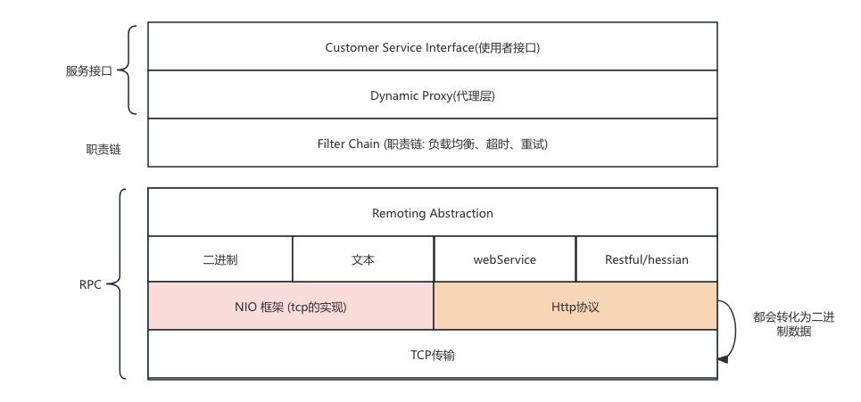

# 分布式服务框架总结

> 本篇读书笔记来源于, 书名: 分布式服务框架原理与实践。作者 李林锋

# 分布式服务框架架构原理

## 分布式服务框架整体架构

## RPC

### 维基百科定义

> In [distributed computing](https://en.wikipedia.org/wiki/Distributed_computing), a **remote procedure call** (**RPC**) is when a [computer program](https://en.wikipedia.org/wiki/Computer_program) causes a [procedure](https://en.wikipedia.org/wiki/Procedural_programming) (subroutine) to execute in a different [address space](https://en.wikipedia.org/wiki/Address_space) (commonly on another computer on a shared [computer network](https://en.wikipedia.org/wiki/Computer_network)), which is written as if it were a normal (local) procedure call, without the [programmer](https://en.wikipedia.org/wiki/Programmer) explicitly writing the details for the remote interaction. That is, the programmer writes essentially the same code whether the subroutine is local to the executing program, or remote. This is a form of [client–server interaction](https://en.wikipedia.org/wiki/Client–server_model) (caller is [client](https://en.wikipedia.org/wiki/Client_(computing)), executor is [server](https://en.wikipedia.org/wiki/Server_(computing))), typically implemented via a [request–response](https://en.wikipedia.org/wiki/Request–response) [message passing](https://en.wikipedia.org/wiki/Message_passing) system. In the [object-oriented programming](https://en.wikipedia.org/wiki/Object-oriented_programming) paradigm, RPCs are represented by remote method invocation (RMI). The RPC model implies a level of location transparency, namely that calling procedures are largely the same whether they are local or remote, but usually, they are not identical, so local calls can be distinguished from remote calls. Remote calls are usually orders of magnitude slower and less reliable than local calls, so distinguishing them is important.
>
> 
>
> RPC is a request–response protocol. An RPC is initiated by the *client*, which sends a request message to a known remote *server* to execute a specified procedure with supplied parameters. The remote server sends a response to the client, and the application continues its process. While the server is processing the call, the client is blocked (it waits until the server has finished processing before resuming execution), unless the client sends an asynchronous request to the server, such as an XMLHttpRequest. There are many variations and subtleties in various implementations, resulting in a variety of different (incompatible) RPC protocols.
>
> 实现:
>
> - [
>   NFS](https://en.wikipedia.org/wiki/Network_File_System) (Network File System) is one of the most prominent users of RPC
>   [NFS](https://en.wikipedia.org/wiki/Network_File_System)（网络文件系统）是 RPC 最突出的用户之一
> - [Open Network Computing RPC](https://en.wikipedia.org/wiki/Sun_RPC), by Sun Microsystems (also known as Sun RPC)
>   [Open Network Computing RPC](https://en.wikipedia.org/wiki/Sun_RPC)，由 Sun Microsystems 提供（也称为 Sun RPC）
> - D-Bus open source IPC program provides similar function to CORBA.
>   D-Bus 开源 IPC 程序提供与 CORBA 类似的功能。
> - SORCER provides the API and exertion-oriented language (EOL) for a federated method invocation
>   SORCER 为联合方法调用提供 API 和面向执行的语言 （EOL）
> - [XML-RPC](https://en.wikipedia.org/wiki/XML-RPC) is an RPC protocol that uses XML to encode its calls and [HTTP](https://en.wikipedia.org/wiki/HTTP) as a transport mechanism.
>   [XML-RPC](https://en.wikipedia.org/wiki/XML-RPC) 是一种 RPC 协议，它使用 XML 对其调用进行编码，并使用 [HTTP](https://en.wikipedia.org/wiki/HTTP) 作为传输机制。
> - [JSON-RPC](https://en.wikipedia.org/wiki/JSON-RPC) is an RPC protocol that uses JSON-encoded messages.
>   [JSON-RPC](https://en.wikipedia.org/wiki/JSON-RPC) 是一种使用 JSON 编码消息的 RPC 协议。
> - [JSON-WSP](https://en.wikipedia.org/wiki/JSON-WSP) is an RPC protocol that is inspired from JSON-RPC.
>   [JSON-WSP](https://en.wikipedia.org/wiki/JSON-WSP) 是一种受 JSON-RPC 启发的 RPC 协议。
> - [SOAP](https://en.wikipedia.org/wiki/SOAP) is a successor of XML-RPC and also uses XML to encode its HTTP-based calls.
>   [SOAP](https://en.wikipedia.org/wiki/SOAP) 是 XML-RPC 的后继者，也使用 XML 对其基于 HTTP 的调用进行编码。
> - ZeroC's [Internet Communications Engine](https://en.wikipedia.org/wiki/Internet_Communications_Engine) (Ice) distributed computing platform.
>   ZeroC 的 [Internet Communications Engine](https://en.wikipedia.org/wiki/Internet_Communications_Engine) （Ice） 分布式计算平台。
> - [Etch](https://en.wikipedia.org/wiki/Etch_(protocol)) framework for building network services.
>   用于构建网络服务的 [Etch](https://en.wikipedia.org/wiki/Etch_(protocol)) 框架。
> - Apache Thrift protocol and framework.
>   Apache Thrift 协议和框架。
> - [CORBA](https://en.wikipedia.org/wiki/CORBA) provides remote procedure invocation through an intermediate layer called the *object request broker*.
>   [CORBA](https://en.wikipedia.org/wiki/CORBA) 通过称为*对象请求代理*的中间层提供远程过程调用。
> - [Libevent](https://en.wikipedia.org/wiki/Libevent) provides a framework for creating RPC servers and clients.[[12\]](https://en.wikipedia.org/wiki/Remote_procedure_call#cite_note-12)
>   [Libevent](https://en.wikipedia.org/wiki/Libevent) 提供了用于创建 RPC 服务器和客户端的框架。[[12\]](https://en.wikipedia.org/wiki/Remote_procedure_call#cite_note-12)
> - Windows Communication Foundation is an application programming interface in the .NET framework for building connected, service-oriented applications.
>   Windows Communication Foundation 是 .NET Framework 中的一个应用程序编程接口，用于构建连接的、面向服务的应用程序。
> - Microsoft .NET Remoting offers RPC facilities for distributed systems implemented on the Windows platform. It has been superseded by [WCF](https://en.wikipedia.org/wiki/Windows_Communication_Foundation).
>   Microsoft .NET Remoting 为在 Windows 平台上实现的分布式系统提供 RPC 工具。它已被 [WCF](https://en.wikipedia.org/wiki/Windows_Communication_Foundation) 取代。
> - The Microsoft DCOM uses MSRPC which is based on [DCE/RPC](https://en.wikipedia.org/wiki/DCE/RPC)
>   Microsoft DCOM 使用基于 [DCE/RPC](https://en.wikipedia.org/wiki/DCE/RPC) 的 MSRPC
> - The Open Software Foundation DCE/RPC Distributed Computing Environment (also implemented by Microsoft).
>   开放软件基金会 DCE/RPC 分布式计算环境（也由 Microsoft 实现）。
> - [Google Protocol Buffers (protobufs)](https://en.wikipedia.org/wiki/Protocol_Buffers) package includes an interface definition language used for its RPC protocols[[13\]](https://en.wikipedia.org/wiki/Remote_procedure_call#cite_note-13) open sourced in 2015 as gRPC.[[14\]](https://en.wikipedia.org/wiki/Remote_procedure_call#cite_note-14)
>   [Google Protocol Buffers （protobufs）](https://en.wikipedia.org/wiki/Protocol_Buffers) 包包括一种接口定义语言，用于其 RPC 协议[[13\]](https://en.wikipedia.org/wiki/Remote_procedure_call#cite_note-13)，该语言于 2015 年作为 gRPC 开源。[[14\]](https://en.wikipedia.org/wiki/Remote_procedure_call#cite_note-14)
> - [WAMP](https://en.wikipedia.org/wiki/Web_Application_Messaging_Protocol) combines RPC and Publish-Subscribe into a single, transport-agnostic protocol.
>   [WAMP](https://en.wikipedia.org/wiki/Web_Application_Messaging_Protocol) 将 RPC 和 Publish-Subscribe 合并到一个与传输无关的协议中。
> - Google Web Toolkit uses an asynchronous RPC to communicate to the server service.[[15\]](https://en.wikipedia.org/wiki/Remote_procedure_call#cite_note-15)
>   Google Web Toolkit 使用异步 RPC 与服务器服务通信。[[15\]](https://en.wikipedia.org/wiki/Remote_procedure_call#cite_note-15)
> - Apache Avro provides RPC where client and server exchange schemas in the connection handshake and code generation is not required.
>   Apache Avro 提供 RPC，其中不需要客户端和服务器在连接握手和代码生成中交换架构。

### 为什么有了http还需要使用RPC?

参考下面文章.

https://blog.csdn.net/qq_45808700/article/details/131664118

